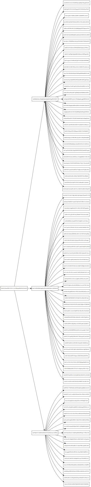

我们为刚开始涉猎IPFS的同学们准备了一些简单的例子，下面的列表后续会逐渐增加。这些例子通过ipfs托管的渲染器进行查看。

* 有向无环图(Dags, Direct Acyclic Graph)、对象(objects)和区块(blocks)
* 集群(Be the swarm)
* 固定(Pinning)
* 启动自己的ipfs
* 简单的ipfs快照
* 星际命名系统
* 修改bootstrap peers列表
* 配置自己的节点
* 增加和播放视频
* 通过图像展示对象
* 让Git更加分布式
* 使用IPFS托管网站

---

## 有向无环图(Dags, Direct Acyclic Graph)、对象(objects)和区块(blocks)

处理区块

`ipfs add` 命令用来从你指定的文件的数据来创建Merkle DAG. 当执行该操作的时候，它遵循[unixfs data format](https://github.com/ipfs/go-ipfs/blob/master/unixfs/pb/unixfs.proto). 这意味着你制定的文件会被切分放到区块里面，然后按照树状结构使用’link nodes’把区块绑定在一起。给定文件的哈希实际上是DAG的根结点的哈希。对于给定的DAG，你可以很容易使用`ipfs ls`查看子区块。

例子:
```
# 确保文件大于256k
ipfs add alargefile 
ipfs ls thathash
```

上面的命令会打印如下信息:
```
ipfs@earth ~> ipfs ls qms2hjwx8qejwm4nmwu7ze6ndam2sfums3x6idwz5myzbn
qmv8ndh7ageh9b24zngaextmuhj7aiuw3scc8hkczvjkww 7866189 
qmuvjja4s4cgyqyppozttssquvgcv2n2v8mae3gnkrxmol 7866189 
qmrgjmlhlddhvxuieveuuwkeci4ygx8z7ujunikzpfzjuk 7866189 
qmrolalcquyo5vu5v8bvqmgjcpzow16wukq3s3vrll2tdk 7866189 
qmwk51jygpchgwr3srdnmhyerheqd22qw3vvyamb3emhuw 5244129
```

它会显示给定文件的直接子区块信息，包含子区块的大小以及其子区块。

### 使用区块可以做点什么？
如果你乐于发现尝试新事物的话，你可以从不同的区域获取到很多不同的信息。你可以使用子区块的哈希作为`ipfs cat`的输入只能查看任意给定的子树的数据（该区块的数据和它的子区块的数据）。如果只需要查看给定区块的数据，不包括它的子节点，使用`ipfs block get`. 但是需要注意的是，`ipfs block get`会在你的屏幕上打印出直接区块的DAG的二进制的数据。

`ipfs block stat` 获取指定区块的精确大小（不包含它的孩子结点），`ipfs refs` 获取指定区块的所有孩子结点。 `ipfs ls` or `ipfs object links` 获取所有孩子结点和它们的大小。 如果你想要编写脚本运行在指定区块的孩子结点上，`ipfs refs` 是更好的选择。

### 区块和对象的对比
在IPFS, 区块是指由键值（哈希值）标识的单个数据单元。一个区块可以是任意类型的数据，不要求一定是某种特定的格式。而对象是指遵循Merkle DAG protobuf数据格式的区块。对象可以通过 `ipfs object`解析和操作。任意给定的哈希值代表一个对象或区块。

### 从头开始创建区块
创建自己的区块是很简单的。只要把数据放到一个文件里面，然后执行`ipfs block put <yourfile>` . 或者通过管道把文件数据传进`ipfs block put`, 像这样:

```
$ echo "This is some data" | ipfs block put
QmfQ5QAjvg4GtA3wg3adpnDJug8ktA1BxurVqBD8rtgVjM
$ ipfs block get QmfQ5QAjvg4GtA3wg3adpnDJug8ktA1BxurVqBD8rtgVjM
This is some data
```
注意: 你不能使用`ipfs cat`读取自己创建的区块。原因是自己创建的区块是非unixfs数据结构的原始数据. 请使用`ipfs block get`读取原始区块。

By [whyrusleeping](http://github.com/whyrusleeping)

---

## 集群(Be the swarm)


IPFS里面充满了网络! 它里面包含了一组实用的命令可以帮助查看网络。

查看你连接到了哪些对等结点:

```sh
ipfs swarm peers
```

手动连接到一个特定的对等结点. 如果对等结点不能工作，请从`ipfs swarm peers`返回的列表里面选择一个。

```sh
ipfs swarm connect /ip4/104.236.176.52/tcp/4001/ipfs/QmSoLnSGccFuZQJzRadHn95W2CrSFmZuTdDWP8HXaHca9z
```

查询网络上一个给定的对等结点:

```sh
ipfs dht findpeer QmSoLnSGccFuZQJzRadHn95W2CrSFmZuTdDWP8HXaHca9z
```

By [whyrusleeping](http://github.com/whyrusleeping)

---

## 固定（Pinning）
固定（Pinning）在ipfs里面是一个很重要的概念。ipfs语义学试图让每一个对象看起来都像是在本地，没有诸如“从远端服务器获取文件, 无论实际上对象是在哪里，`ipfs cat` or `ipfs get`表现出一样的行为. 尽管这个理念很好, 但是有的时候你还是想要能够自己控制。固定（Pinning）允许你去告诉ipfs总是在本地保留给定的对象。ipfs有相当侵略性的缓存机制，那就是你在对象上执行任务ipfs操作，它会把对象在本地缓存一段时间。如果你想阻止垃圾回收，你可以固定你关心的对象。通过`ipfs add`添加的对象默认会被递归的固定。

```
echo "ipfs rocks" > foo
ipfs add foo
ipfs pin ls --type=all
ipfs pin rm <foo hash>
ipfs pin rm -r <foo hash>
ipfs pin ls --type=all
```

正如你已经看到的，第一个`ipfs pin rm`不能正常工作，它会提示给定的哈希被递归固定。在ipfs的世界里，有三种类型的固定；直接固定，固定单一的区块；递归固定，固定给定的区别以及它所有的孩子结点；间接固定，给定区块的父节点被递归固定。

被固定的对象不会被垃圾回收。如果你不相信的话，可以尝试一下如下命令。
```
ipfs add foo
ipfs repo gc
ipfs cat <foo hash>
```

但是如果foo不知道为何被取消了固定的话…
```
ipfs pin rm -r <foo hash>
ipfs repo gc
ipfs cat <foo hash>
```

By [whyrusleeping](http://github.com/whyrusleeping)

---

## 启动自己的ipfs服务
启动ipfs的时候，默认有一些服务会运行，比如dht、bitswap和诊断服务。这些简单的服务都会在对等结点的宿主机上注册一个处理器，监听接受新的连接。`corenet`包有针对这个功能有一个干净的接口。那让我们试图创建一个简单的演示服务来试用一下。

让我们从创建宿主服务开始:
```
package main

import (
        "fmt"

        core "github.com/ipfs/go-ipfs/core"
        corenet "github.com/ipfs/go-ipfs/core/corenet"
        fsrepo "github.com/ipfs/go-ipfs/repo/fsrepo"

        "code.google.com/p/go.net/context"
)
```

这里我们不需要倒入太多的包。
现在，我们唯一要做的其他事情就是我们的主函数：

安装一个ipfs结点.

```
func main() {
        // Basic ipfsnode setup
        r, err := fsrepo.Open("~/.ipfs")
        if err != nil {
                panic(err)
        }

        ctx, cancel := context.WithCancel(context.Background())
        defer cancel()

        cfg := &core.BuildCfg{
                Repo:   r,
                Online: true,
        }

        nd, err := core.NewNode(ctx, cfg)

        if err != nil {
                panic(err)
        }
```

上面只是从在用户目录`~/.ipfs`的配置来初始化默认的ipfs结点的简单的模板。

下一步，我们将要创建我们的服务。

```
        list, err := corenet.Listen(nd, "/app/whyrusleeping")
        if err != nil {
                panic(err)
        }

        fmt.Printf("I am peer: %s\n", nd.Identity.Pretty())

        for {
                con, err := list.Accept()
                if err != nil {
                        fmt.Println(err)
                        return
                }

                defer con.Close()

                fmt.Fprintln(con, "Hello! This is whyrusleepings awesome ipfs service")
                fmt.Printf("Connection from: %s\n", con.Conn().RemotePeer())
        }
}
```

上面是你基于ipfs写一个服务所需要的全部。当对等结点连接进来，我们发送给它们问候，在日志里面打印它们的ID，最后关闭会话。这是最简单的服务，并且你可以扩展更多去处理进来的连接。

现在我们需要一个对等结点来连接我们：

```
package main

import (
        "fmt"
        "io"
        "os"

        core "github.com/ipfs/go-ipfs/core"
        corenet "github.com/ipfs/go-ipfs/core/corenet"
        peer "github.com/ipfs/go-ipfs/p2p/peer"
        fsrepo "github.com/ipfs/go-ipfs/repo/fsrepo"

        "golang.org/x/net/context"
)

func main() {
        if len(os.Args) < 2 {
                fmt.Println("Please give a peer ID as an argument")
                return
        }
        target, err := peer.IDB58Decode(os.Args[1])
        if err != nil {
                panic(err)
        }

        // Basic ipfsnode setup
        r, err := fsrepo.Open("~/.ipfs")
        if err != nil {
                panic(err)
        }

        ctx, cancel := context.WithCancel(context.Background())
        defer cancel()

        cfg := &core.BuildCfg{
                Repo:   r,
                Online: true,
        }

        nd, err := core.NewNode(ctx, cfg)

        if err != nil {
                panic(err)
        }

        fmt.Printf("I am peer %s dialing %s\n", nd.Identity, target)

        con, err := corenet.Dial(nd, target, "/app/whyrusleeping")
        if err != nil {
                fmt.Println(err)
                return
        }

        io.Copy(os.Stdout, con)
}
```

这个对等结点将会建立它的ipfs结点（注意：这有点耗费系统资源，正常情况你不会为单独的链接分配一个实例），并且连接刚创建的服务。

执行下面的命令去尝试一下：
```
$ ipfs init # if you havent already
$ go run host.go
```
上面应该会打印出对等结点的ID，拷贝并且在第二台计算机上使用
```
$ ipfs init # if you havent already
$ go run client.go <peerID>
```

它应该会打印出`Hello! This is whyrusleepings awesome ipfs service`

现在，你可能会有疑问：“我为什么要这么用？它比`net`包会更好吗？”。好的，这里是一些好处。

1. 你在连接一个特定的对等结点ID，不用关心对等结点的IP是否发生了变化。
2. 你利用了内建在我们net包里面的NAT穿越
3. 和端口相比，你获取到更有意义的协议ID字串。

By [whyrusleeping](http://github.com/whyrusleeping)

---

## 简单的ipfs快照
让我们快速浏览一下如何对ipfs进行基本的快照。

保存你的目录：
```
$ ipfs add -r ~/code/myproject
```

记录哈希：
```
$ echo $hash `date` >> snapshots
```


或者一次性的：
```
$ echo `ipfs add -q -r ~/code/myproject | tail -n1` `date` >> snapshots
```
(注意: `-q` 只会输出哈希, 通过管道传给`tail -n1`来确保只输出顶级文件夹的哈希.)

确保针对挂载点有合适的用户权限（拥有者）：
```
$ sudo mkdir /ipfs /ipns
$ sudo chown `whoami` /ipfs /ipns
```

为了能够从ifps `mount`目录，你需要安装`Fuse`。你可以从[install `Fuse` in the `go-ipfs` docs](https://github.com/ipfs/go-ipfs/blob/master/docs/fuse.md)查看如何安装。

查看活跃的快照：
```
$ ipfs mount
$ ls /ipfs/$hash/

# can also

$ cd /ipfs/$hash/
$ ls
```

通过fuse接口，你能够访问你当时创建快照的文件。

By [whyrusleeping](http://github.com/whyrusleeping)

---

## 星际命名系统
星际命名系统是一种增加少量的可变性到永久不变的ipfs的一种方式。它允许你存在在你的对等结点ID（你的公钥的哈希）的命名空间下面ipfs哈希的索引。建立它的方式非常简单。

首先，你有一些内容需要发布：

```
$ echo 'Let us have some mutable fun!' | ipfs add
```

记下上面打印出来的哈希，在这里用它来发布内容到网络：

```
$ ipfs name publish <that hash>
Published to <your peer ID>: <that hash>
```

现在，测试一下是否正常工作，你可以尝试一些不同的东西：

```
$ ipfs name resolve <your peer ID>
<that hash>
```

如果你在同一台机器上执行上面的命令，它应该会马上返回，因为你已经在本地缓存了入口信息；我们在其他运行ipfs的机器上试一下。

另一种尝试的方式就是在网关上面：

```
https://ipfs.io/ipns/<your peer ID>
```

下面是有趣的一部分，我们来改变内容：

```
$ echo 'Look! Things have changed!' | ipfs add
```

下一步，我们拿到上一步里面的哈希...
```
$ ipfs name publish <the new hash>
Published to <your peer ID>: <the new hash>
```
看！现在，如果你重新访问刚刚那个入口，你讲看到新的对象。

恭喜！你刚刚成功的发布了内容，并且看了成功看到发布的内容！注意更新ipns入口可能会“破坏连结”因为索引到ipns入口的东西可以不再指向它所期望的内容。没有方式可以解决它，因此如果你想要确保永久性，要小心的使用ipns连结。将来，我们可能ipns入口像git commit链那样，这样的话，每一个新的入口都会有它的历史回溯。

By [whyrusleeping](http://github.com/whyrusleeping)

---

## 修改bootstrap peers列表

IPFS自举列表是一组可以获知网络上其他对等结点的对等结点。IPFS给出了默认的一组可以信任的对等结点，但是你可以自由的修改这个列表来满足你的要求。一个重要的用途就是你可以创建一个个人IPFS网络。

首先，我们列出自举列表：

```
> ipfs bootstrap list
/ip4/104.131.131.82/tcp/4001/ipfs/QmaCpDMGvV2BGHeYERUEnRQAwe3N8SzbUtfsmvsqQLuvuJ
/ip4/104.236.151.122/tcp/4001/ipfs/QmSoLju6m7xTh3DuokvT3886QRYqxAzb1kShaanJgW36yx
/ip4/104.236.176.52/tcp/4001/ipfs/QmSoLnSGccFuZQJzRadHn95W2CrSFmZuTdDWP8HXaHca9z
/ip4/104.236.179.241/tcp/4001/ipfs/QmSoLpPVmHKQ4XTPdz8tjDFgdeRFkpV8JgYq8JVJ69RrZm
/ip4/104.236.76.40/tcp/4001/ipfs/QmSoLV4Bbm51jM9C4gDYZQ9Cy3U6aXMJDAbzgu2fzaDs64
/ip4/128.199.219.111/tcp/4001/ipfs/QmSoLSafTMBsPKadTEgaXctDQVcqN88CNLHXMkTNwMKPnu
/ip4/162.243.248.213/tcp/4001/ipfs/QmSoLueR4xBeUbY9WZ9xGUUxunbKWcrNFTDAadQJmocnWm
/ip4/178.62.158.247/tcp/4001/ipfs/QmSoLer265NRgSp2LA3dPaeykiS1J6DifTC88f5uVQKNAd
/ip4/178.62.61.185/tcp/4001/ipfs/QmSoLMeWqB7YGVLJN3pNLQpmmEk35v6wYtsMGLzSr5QBU3
```
上面列出来的是默认的IPFS自举列表，它们是有IPFS开发团队建立。这些地址是完全可以解析，并且使用[multiaddr](https://github.com/jbenet/multiaddr)格式表示。通过这种方式，你的结点很清楚的知道怎么访问这些自举结点，这些位置信息是没有歧义的。

不要修改这些列表除非你理解它其中的含义。自举在分布式系统中是一个很重要的安全隐患：恶意的自举结点只能引导你到其他恶意的结点。因此推荐使用IPFS开发团队提供的默认自举列表，另外一种情况就是如果你要建立自己的私有网络，使用你可以控制的一组自举列表。不要添加你不信任的结点。

这里我们增加一个新的结点到自举列表：
```
> ipfs bootstrap add /ip4/25.196.147.100/tcp/4001/ipfs/QmaMqSwWShsPg2RbredZtoneFjXhim7AQkqbLxib45Lx4S
```

这里我们从自举列表移除一个结点：
```
> ipfs bootstrap rm /ip4/128.199.219.111/tcp/4001/ipfs/QmSoLSafTMBsPKadTEgaXctDQVcqN88CNLHXMkTNwMKPnu
```

如果我们想要创建一份我们自举列表的备份。我们可以通过保存`ipfs bootstrap list`到输出到一个文件里面。
```
> ipfs bootstrap list >save
```

如果我们想要重新开始，我们可以一次性的删除整个自举列表：
```
> ipfs bootstrap rm --all
```

在一个空的自举列表的情况下，我们可以恢复默认的自举列表：
```
> ipfs bootstrap add --default
``` 

再次移除整个自举列表，我们把我们保存的自举列表通过管道定向到`ipfs bootstrap add`来回复我们之前保存的自举列表：
```
> ipfs bootstrap rm --all
> cat save | ipfs bootstrap add
```


By [jbenet](http://github.com/jbenet) and [insanity54](http://github.com/insanity54)

---

## 配置自己的节点

通过保存在`~/.ipfs/config`的json格式的文件来配置ipfs。

### 地址
地址文件保存了不同的地址类型，它们都是使用多地址的地址格式。让我们来看下每种地址类型代表什么意思。

```
"Addresses": {
    "Swarm": [
      "/ip4/0.0.0.0/tcp/4001"
    ],
    "API": "/ip4/127.0.0.1/tcp/5001",
    "Gateway": "/ip4/127.0.0.1/tcp/8080"
  }
```

#### 集群（Swarm）
集群地址是本地的守护进程为接受其他ipfs对等结点的连接而侦听的地址。你应该尝试确保这些地址可以被其他的计算机访问，没有防火墙拦截你指定的端口。

#### API
API地址是本地的守护进程提供HTTP API而侦听的地址。该API用来控制命令行的守护进程，如果你敢于挑战的话，可以使用curl来访问。你应该确保这个地址不能被外部的机器访问，否则其他潜在的恶意组织可能会发送命令到你的ipfs守护进程。

#### 网关（Gateway）
网关地址是本地守护进程提供网关接口而侦听的地址。该网管用来通过ipfs查看文件，服务静态网站内容。至于该地址是否可以被外部的地址访问，决定权在于你。该地址是可选的，如果为空的话，网关服务器将不会启动。

### Mounts
如果`ipfs mount`没有指定mount目录，mounts配置为ipfs和ipns虚拟文件系统指定的默认的mountpoints。这些文件夹应该存在，并且你的用户有权限通过fuse mount到这些目录。

### 自举（Bootstrap）
自举配置组指定了一组守护进程在启动的时候会连接的ipfs对等结点。默认的值是’ipfs solarnet’结点，它是部署在不同的国家的VPS servers.

By [whyrusleeping](http://github.com/whyrusleeping)

---

## 增加和播放视频

ipfs可以被用来存储和播放视频。假设我们增加了一个视频：

```
ipfs add -q sintel.mp4 | tail -n1
```

拿到上面的哈希，你可以通过不同的方式查看：

通过命令行：
```
ipfs cat $vidhash | mplayer -vo xv -
```

通过本地网关：
```
mplayer http://localhost:8080/ipfs/$vidhash

# 通过浏览器打开

chromium http://localhost:8080/ipfs/$vidhash
```
(注意: 该网关访问方式可以工作与大部分视频播放器和浏览器。)

By [whyrusleeping](http://github.com/whyrusleeping)

---
## 通过图像展示对象

### 可视对象（Graphing Objects）


当我们使用ipfs存储文件或者写更复杂的数据结构的时候，可视化被创建的merkledag是非常有用的。为此，我写了一个简单的工具`graphmd` (graph merkle dag)。

`graphmd`是一个很短的shell脚本([source](./graphmd))。它使用`ipfs refs —format`产生`dot`输出。

### 安装graphmd

`graphmd`很快将会有它自己的仓库，但是现在可以这么安装：

```
ipfs cat Qmcd7Sebd46vxDWjbUERK8w82zp8sgWTtHT5c93kzr2v3M  >/usr/local/bin/graphmd
chmod +x /usr/local/bin/graphmd
```

### graphmd用法

```
> graphmd
usage: graphmd <ipfs-path>...
output merkledag links in graphviz dot

use it with dot:
  bin/graphmd QmZPAMWUfLD95GsdorXt9hH7aVrarb2SuLDMVVe6gABYmx | dot -Tsvg
  bin/graphmd QmZPAMWUfLD95GsdorXt9hH7aVrarb2SuLDMVVe6gABYmx | dot -Tpng
  bin/graphmd QmZPAMWUfLD95GsdorXt9hH7aVrarb2SuLDMVVe6gABYmx | dot -Tpdf
```

### 例子

给定[demo](https://ipfs.io/ipfs/QmRCJXG7HSmprrYwDrK1GctXHgbV7EYpVcJPQPwevoQuqF) 这个目录:

```sh
> tree demo
demo
├── cat.jpg
└── test
    ├── bar
    ├── baz
    │   ├── b
    │   └── f
    └── foo

2 directories, 5 files
```

添加文件到ipfs

```sh
> ipfs add -r demo
added QmajFHHivh25Qb2cNbnnnEeUe1gDLHX9ta7hs2XKX1vazb demo/cat.jpg
added QmTz3oc4gdpRMKP2sdGUPZTAGRngqjsi99BPoztyP53JMM demo/test/bar
added QmTz3oc4gdpRMKP2sdGUPZTAGRngqjsi99BPoztyP53JMM demo/test/baz/b
added QmYNmQKp6SuaVrpgWRsPTgCQCnpxUYGq76YEKBXuj2N4H6 demo/test/baz/f
added QmX1ebVUtfY11ZCpVmqyE5mDoN62SpLd8eLPpg5GGV1ABt demo/test/baz
added QmYNmQKp6SuaVrpgWRsPTgCQCnpxUYGq76YEKBXuj2N4H6 demo/test/foo
added QmNtpA5TBNqHrKf3cLQ1AiUKXiE4JmUodbG5gXrajg8wdv demo/test
added QmRCJXG7HSmprrYwDrK1GctXHgbV7EYpVcJPQPwevoQuqF demo
```

用`graphmd`去生成`dot`输出

```sh
> graphmd QmRCJXG7HSmprrYwDrK1GctXHgbV7EYpVcJPQPwevoQuqF >graph.dot
digraph {
  graph [rankdir=LR];
  QmRCJXG7HSmprrYwDrK1GctXHgbV7EYpVcJPQPwevoQuqF [fontsize=8 shape=box];
  QmajFHHivh25Qb2cNbnnnEeUe1gDLHX9ta7hs2XKX1vazb [fontsize=8 shape=box];
  QmRCJXG7HSmprrYwDrK1GctXHgbV7EYpVcJPQPwevoQuqF -> QmajFHHivh25Qb2cNbnnnEeUe1gDLHX9ta7hs2XKX1vazb [label="cat.jpg"];
  QmRCJXG7HSmprrYwDrK1GctXHgbV7EYpVcJPQPwevoQuqF [fontsize=8 shape=box];
  QmNtpA5TBNqHrKf3cLQ1AiUKXiE4JmUodbG5gXrajg8wdv [fontsize=8 shape=box];
  QmRCJXG7HSmprrYwDrK1GctXHgbV7EYpVcJPQPwevoQuqF -> QmNtpA5TBNqHrKf3cLQ1AiUKXiE4JmUodbG5gXrajg8wdv [label="test"];
  QmNtpA5TBNqHrKf3cLQ1AiUKXiE4JmUodbG5gXrajg8wdv [fontsize=8 shape=box];
  QmTz3oc4gdpRMKP2sdGUPZTAGRngqjsi99BPoztyP53JMM [fontsize=8 shape=box];
  QmNtpA5TBNqHrKf3cLQ1AiUKXiE4JmUodbG5gXrajg8wdv -> QmTz3oc4gdpRMKP2sdGUPZTAGRngqjsi99BPoztyP53JMM [label="bar"];
  QmNtpA5TBNqHrKf3cLQ1AiUKXiE4JmUodbG5gXrajg8wdv [fontsize=8 shape=box];
  QmX1ebVUtfY11ZCpVmqyE5mDoN62SpLd8eLPpg5GGV1ABt [fontsize=8 shape=box];
  QmNtpA5TBNqHrKf3cLQ1AiUKXiE4JmUodbG5gXrajg8wdv -> QmX1ebVUtfY11ZCpVmqyE5mDoN62SpLd8eLPpg5GGV1ABt [label="baz"];
  QmX1ebVUtfY11ZCpVmqyE5mDoN62SpLd8eLPpg5GGV1ABt [fontsize=8 shape=box];
  QmTz3oc4gdpRMKP2sdGUPZTAGRngqjsi99BPoztyP53JMM [fontsize=8 shape=box];
  QmX1ebVUtfY11ZCpVmqyE5mDoN62SpLd8eLPpg5GGV1ABt -> QmTz3oc4gdpRMKP2sdGUPZTAGRngqjsi99BPoztyP53JMM [label="b"];
  QmX1ebVUtfY11ZCpVmqyE5mDoN62SpLd8eLPpg5GGV1ABt [fontsize=8 shape=box];
  QmYNmQKp6SuaVrpgWRsPTgCQCnpxUYGq76YEKBXuj2N4H6 [fontsize=8 shape=box];
  QmX1ebVUtfY11ZCpVmqyE5mDoN62SpLd8eLPpg5GGV1ABt -> QmYNmQKp6SuaVrpgWRsPTgCQCnpxUYGq76YEKBXuj2N4H6 [label="f"];
  QmNtpA5TBNqHrKf3cLQ1AiUKXiE4JmUodbG5gXrajg8wdv [fontsize=8 shape=box];
  QmYNmQKp6SuaVrpgWRsPTgCQCnpxUYGq76YEKBXuj2N4H6 [fontsize=8 shape=box];
  QmNtpA5TBNqHrKf3cLQ1AiUKXiE4JmUodbG5gXrajg8wdv -> QmYNmQKp6SuaVrpgWRsPTgCQCnpxUYGq76YEKBXuj2N4H6 [label="foo"];
}
```

通过管道定向到 `dot`产生`svg`, `pdf`, `png` or [whatever](http://www.graphviz.org/Documentation/dotguide.pdf)

```
graphmd QmRCJXG7HSmprrYwDrK1GctXHgbV7EYpVcJPQPwevoQuqF | dot -Tsvg >output/graph.svg
graphmd QmRCJXG7HSmprrYwDrK1GctXHgbV7EYpVcJPQPwevoQuqF | dot -Tpdf >output/graph.pdf
graphmd QmRCJXG7HSmprrYwDrK1GctXHgbV7EYpVcJPQPwevoQuqF | dot -Tpng >output/graph.png
```

Et voilà: [svg](https://ipfs.io/ipfs/QmbefthRKDReojALJi8nGPwvUVPqe1aXdoD9ysX44aUfvG/graph.svg), [pdf](/ipfs/QmbefthRKDReojALJi8nGPwvUVPqe1aXdoD9ysX44aUfvG/graph.pdf), [png](https://ipfs.io/ipfs/QmbefthRKDReojALJi8nGPwvUVPqe1aXdoD9ysX44aUfvG/graph.png)


### 文件块

`graphmd`检查文件块算法是特别有用的。例如，这里是包含默认的半平衡间接的区块主干的`ipfs` binary看起来的样子。

- [dot output](https://ipfs.io/ipfs/QmQ8yWC1SGn73P1SPSw8iqSBGEscve1N6sQpzd1xzD5EV1/graph.dot)
- [svg render](https://ipfs.io/ipfs/QmQ8yWC1SGn73P1SPSw8iqSBGEscve1N6sQpzd1xzD5EV1/graph.svg)
- [pdf render](https://ipfs.io/ipfs/QmQ8yWC1SGn73P1SPSw8iqSBGEscve1N6sQpzd1xzD5EV1/graph.pdf)



by [Juan Benet](https://github.com/jbenet)

---

## 让Git更加分布式

你是否曾经对自己说过：“哥们，我的git服务器不够分布式”或“我希望有更简单的方式可以在全世界范围内服务一个静态的git仓库”。现在不在是想象了，下面就是我们的方案。

在这篇文章，我讲讨论如何通过ipfs网络服务git仓库。最终会有个通过ipfs服务的url可以使用`git clone`去克隆仓库。

一开始，我们选择一个你想要托管的git仓库，做一个裸克隆。
```
$ git clone --bare git@myhost.io/myrepo
```
对于不熟悉git的人，裸仓库意味着它不是一个工作树，可以被用做一个服务器。它们和正常的git仓库有一些微小的差别的。

现在，为了让它可以被克隆，需要执行下面命令：
```
$ cd myrepo
$ git update-server-info
```
另外，以可以解包所有的gits对象：
```
$ cp objects/pack/*.pack .
$ git unpack-objects < ./*.pack
$ rm ./*.pack
```

如果你添加git仓库的多个版本，把git大的包文件分解成单独的对象可以允许ipfs去掉重复的对象。

一旦你做完了上面的操作，这个仓库就可以准备开始服务了。剩下的你需要做的就是把它添加到ipfs：
```
$ pwd
/code/myrepo
$ ipfs add -r .
...
...
...
added QmX679gmfyaRkKMvPA4WGNWXj9PtpvKWGPgtXaF18etC95 .
```
现在，可以尝试克隆它了。
```
$ cd /tmp
$ git clone http://localhost:8080/ipfs/QmX679gmfyaRkKMvPA4WGNWXj9PtpvKWGPgtXaF18etC95 myrepo
```

注意: 确保使用你自己的哈希。

现在，你可能想问“好的，我不能做任何修改的git仓库有啥好的呢？”那让我来告诉你一个很好的用例。我想要使用GO进行编程，对于那些不知道go的朋友，使用版本控制来导入一些库
```go
import (
        "github.com/whyrusleeping/mycoollibrary"
)
```

这是一个很棒的特性，解决了很多问题，但是经常，当我使用某人的库的时候，我会遇到一些问题，因为他们改变了API，而这破坏了我的代码。现在使用上面我们说的方法，你可以克隆那个库，把它加到ipfs，你的导入路径看起来像这样：
```go
import (
        mylib "gateway.ipfs.io/ipfs/QmX679gmfyaRkKMvPA4WGNWXj9PtpvKWGPgtXaF18etC95"
)
```

现在你可以确保每次都会有相同的代码。

注意: 因为go不允许使用localhost作为导入路径，因此我们使用公共http网关。这种方式安全性得不到保障，因为中间人攻击可能会修改你的代码。你可以使用域名重定向到localhost来规避这个问题。

By [whyrusleeping](http://github.com/whyrusleeping)

---

##使用IPFS托管网站

简短的介绍如何通过ipfs托管网站

添加你的静态网站到ipfs是很简单的。开启守护进程。
Adding your static website to ipfs is quite simple! Simply turn on your daemon:
```bash
$ ipfs daemon
```
然后添加包含网站的目录
```bash
$ ls mysite
img index.html
$ ipfs add -r mysite
added QmcMN2wqoun88SVF5own7D5LUpnHwDA6ALZnVdFXhnYhAs mysite/img/spacecat.jpg
added QmS8tC5NJqajBB5qFhcA1auav14iHMnoMZJWfmr4k3EY6w mysite/img
added QmYh6HbZhHABQXrkQZ4aRRSoSa6bb9vaKoHeumWex6HRsT mysite/index.html
added QmYeAiiK1UfB8MGLRefok1N7vBTyX8hGPuMXZ4Xq1DPyt7 mysite/
```
最后一个紧跟着文件夹名字的哈希是你所需要的。从现在开始我们就称它为`$SITE_HASH`。

现在，你可以在浏览器中打开`http://localhost:8080/ipfs/$SITE_HASH`。然后，你可以通过另外一个ipfs结点打开`http://localhost:8080/ipfs/$SITE_HASH`来查看。很酷吧？但是使用哈希看起来很丑陋。我们用一些方法去掉哈希值。

首先，你可以做一个简单的DNS TXT记录，包含`dnslink=/ipfs/$SITE_HASH`.一旦记录被广播出去，你就是可以通过打开`http://localhost:8080/ipns/your.domain`来查看网站。现在看起来就舒服多了。你还可以通过打开 `http://gateway.ipfs.io/ipns/your.domain`来访问。

下面，你可能要问“如果我想改变我的网站呢，DNS太慢了。”好的，我来给你介绍一下lpns. Lpns是星际命名系统，你可能已经注意到上面的链接包含`/ipns/`而不是`/ipfs/`。Ipns用于在ipfs网络中可变的内容，它相对而言很容易使用，也允许你在不更新dns的情况下改变你的网站。那怎么去用呢？

在添加网站页面之后，做下面操作：
```bash
$ ipfs name publish $SITE_HASH
Published to <your peer id>: /ipfs/$SITE_HASH
```
（免责声明：当使用IPNS去更新网站的时候，有个事情要去考虑，那就是当更新你的网站的时候，资产可能是从两个不同的哈希加载而来，这个可能会导致过期或丢失的资产，除非不考虑它。）

现在，你可以通过打开 `http://localhost:8080/ipns/<your peer id>`来测试看下能否正常工作。也可能使用在公共网关上的相同的链接。一旦你做好了这些工作，我们来隐藏哈希。修改你的DNS TXT记录，包含`dnslink=/ipns/<your peer id>`，等到记录广播完成之后，然后尝试访问`http://localhost:8080/ipns/your.domain`.

这时，你在ipfs/ipns有了一个网站。你可能想知道你怎么暴露这个网站到`http://your.domain`, 这样网络上的用户不需要知道任何细节就可以访问。这个也是很容易去做的，你所需要做的就是创建TXT记录，然后把`your.domain`的A记录只想侦听在端口80的ipfs守护进行的地址（比如`gateway.ipfs.io`）。浏览器会在请求头里面发送`your.domain`，由于前面你增加了你的dnslink TXT记录，这样ipfs网关会识别 `your.domain`为ipns名字，那么它将会服务 `/ipns/your.domain/`而不是`/`。

那么，如果你把`your.domain`的A记录指向`gateway.ipfs.io`地址，然后等待DNS广播完成，那么任何人不需要额外的配置都可以通过`http://your.domain`来访问托管在ipfs上的网站。

另外，也可以用CNAME记录指向网关的DNS记录。通过这种方式，网关的IP地址会自动更新。然而CNAME记录不允许用于其他记录，例如表示ipfs/ipns记录的TXT。 因为这个，ipfs允许为`_dnslink.your.domain` 创建DNS TXT记录`dnslink=/ipns/<yourpeer id>`。

因此通过为`your.domain`创建CNAME指向`gateway.ipfs.io`，然后用`dnslink=/ipns/<your peer id>` 增加_dnslink.your.domain记录，那么你就可以不需要显示的使用ipfs网关的地址托管你的网站。

Happy Hacking!

By
[Whyrusleeping](https://github.com/whyrusleeping)

---

> 以上部分链接需要翻墙才能打开

Tip打赏

翻译 [Zhang Wenhu](https://www.binstd.com/u/zhangwenhu)

ETH: `0x81b651110BeCf022526F2D7d822761A0A1ef4289`

校对 [zian](https://www.binstd.com/u/zian)

ETH: `0xAf1c0a63Ade4b56e262849235e49D87742C56af4`

站长 [cho](https://www.binstd.com/u/cho)

1. BTC: `1Af2Q23Y1kqgtgbryzjS7RxrnEmyvYuX4b`
2. ETH: `0x6bcCfb7265d4aB0C1a71F7d19b9E581cae73D777`