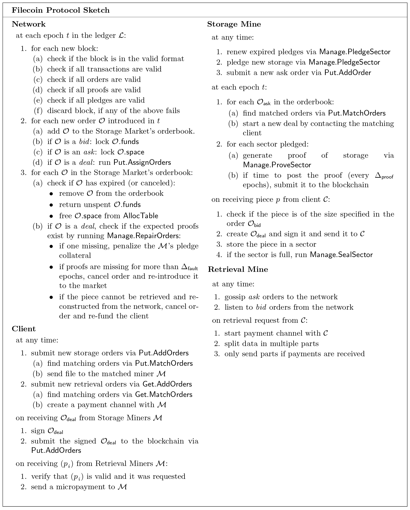
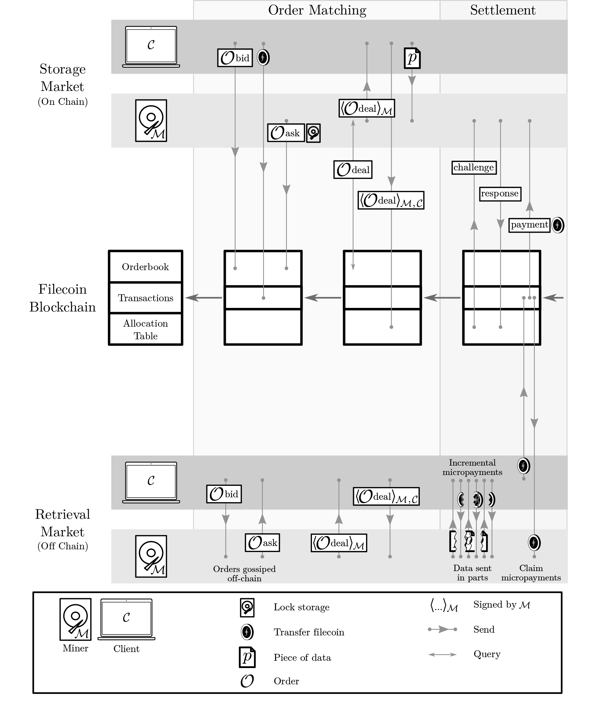
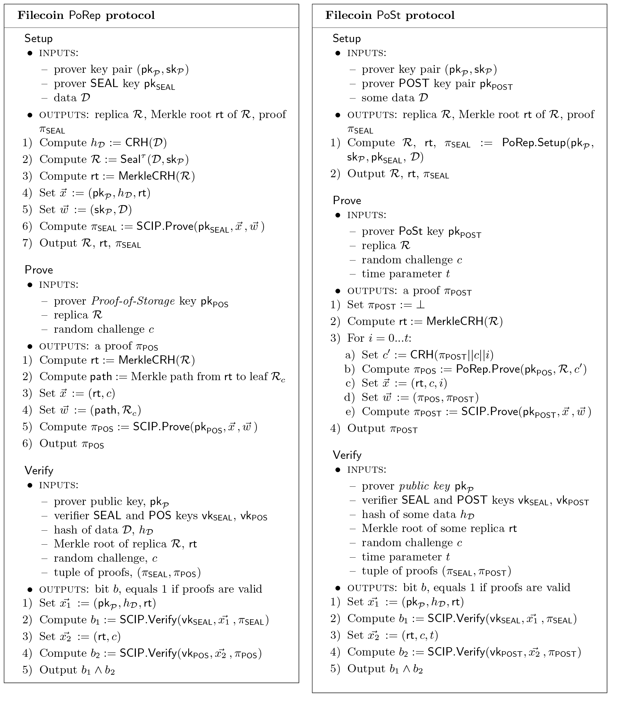

Filecoin 一种去中心化的存储网络

## [摘要](#wp-abstract)

当前互联网正处于一场革命中：集中式专有服务正在被去中心化开放服务所代替；信任式参与被可验证式计算所代替；脆弱的位置寻址被弹性的内容寻址所代替；低效率的整体式服务被点对点算法市场所代替；比特币、以太坊和其他的区块链网络已经证明了去中心化交易账本的有效性。这些公共账本处理复杂的智能合约应用程序和交易价值数百亿美金的加密资产。这些系统的参与者们形成去中心化的、没有中心管理机构或者可信任党派的网络提供了有用的支付服务，这是广泛互联网开放服务的第一个实例。IPFS通过分散的网页自身已经证明了内容寻址的有效性，它提供了全球点对点网络数十亿文件使用。它解放了孤岛数据，网络分区存活，离线工作，审查制度路线，产生了持久的数字信息。

Filecoin是一个去中心化存储网络，它让云存储变成一个算法市场。这个市场运行在有着本地协议令牌（也叫做Filecoin）的区块链。区块链中的旷工可以通过为客户提供存储来获取Filecoin,相反的，客户可以通过花费Filecoin来雇佣旷工来存储或分发数据。和比特币一样，Filecoin的旷工们为了巨大的奖励而竞争式挖区块，但Filecoin的挖矿效率是与存储活跃度成比例的，这直接为客户提供了有用的服务（不像比特币的挖矿仅是为了维护区块链的共识）。这种方式给旷工们创造了强大的激励，激励他们尽可能多的聚集存储器并且把它们出租给客户们。Filecoin协议将这些聚集的资源编织成世界上任何人都能依赖的自我修复的存储网络。该网络通过复制和分散内容实现鲁棒性，同时自动检测和修复副本失败。客户可以选择复制参数来防范不同的威胁模型。该协议的云存储网络还提供了安全性，因为内容是在客户端端对端加密的，而存储提供者不能访问到解密秘钥。Filecoin的成果作为可以为任何数据提供存储基础架构的IPFS最上面的激励层。它对去中心化数据，构建和运行分布式应用程序，以及实现智能合同都非常有用。

这些工作包括以下几部分内容：

（a)介绍Filecoin网络，概述这个协议以及详细介绍几个组件。

（b)形式化去中心化存储网络（DSN)的计划与内容，然后构建Filecoin作为一个DSN。

（c)介绍一种叫“复制证明”的新型存储证明方案，它允许验证任何数据副本都存储在物理上独立的存储器中。

（d)介绍一种新型的以基于顺序复制和存储作为激励度量的有用工作共识。

（e)形成可验证市场，并构建两个市场，存储市场和检索市场，它们分别管理如何从Filecoin写入和读取数据。

（f)讨论用例，如何连接其他系统以及如何使用这个协议。

注意：Filecoin是一项正在进行的工作。正在进行积极的研究，本文的新版本将会出现在https://filecoin.io 如有意见和建议，请通过research@filecoin.io与我们联系

## [1 介绍](#wp-introduction)

Filecoin是一种协议令牌，其区块链运行在一种叫“时空证明”的新型证明机制上，其区块被存储数据的矿工所挖。Filecoin协议通过不依赖于单个协调员的独立存储提供商组成的网络提供数据存储服务和数据检索服务。其中：(1)用户为数据存储和检索支付令牌 (2)存储矿工通过提供存储空间赚取令牌 (3)检索矿工通过提供数据服务赚取令牌

### [1.1 基本组件](#elementary-components)

Filecoin协议由四个新型组件组成

1. 去中心化存储网络(Decentralized Storage Network)(DSN)：我们提供一个由提供存储和检索服务的独立服务商网络的抽象（在第二节）。接着我们提出了Filecoin协议作为激励，可审计和可验证的DSN构建（在第4节）。

2. 新型的存储证明：我们提出了两种新型存储证明方案（在第三节）：（1）“复制证明”（Proof-of-Replication）允许存储提供商证明数据已经被复制到了他自己唯一专用的物理存储设备上了。执行唯一的物理副本使验证者能够检查证明者是否不存在将多个数据副本重复拷贝到同一存储空间。（2）“时空证明”（Proof-of-Spacetime）允许存储提供商证明在指定的时间内存储了某些数据。

3. 可验证市场：我们将存储请求和检索需求作为两个由Filecoin网络操作的去中心化可验证市场的订单进行建模（在第五节）。验证市场确保了当一个服务被正确提供的时候能执行付款。我们介绍了客户和矿工可以分别提交存储和检索订单的存储市场和检索市场。

4. 有效的工作量证明（Proof-of-Work）：我们展示了如何基于“时空证明”来构建有效的工作量证明来应用于共识协议。旷工们不需要花费不必要的计算来挖矿，但相反的必须存储数据于网络中。

### [1.2 协议概述](protocol-overview)

* Filecoin协议是构建于区块链和带有原生令牌的去中心化存储网络。客户花费令牌来存储数据和检索数据，而矿工们通过提供存储和检索数据来赚取令牌。
* Filecoin DSN 分别通过两个可验证市场来处理存储请求和检索请求：存储市场和检索市场。客户和矿工设定所要求服务的价格和提供服务的价格，并将其订单提交到市场。
* 市场由Filecoin网络来操作，该网络采用了“时空证明”和“复制证明”来确保矿工们正确存储他们承诺存储的数据。
* 最后，矿工们能参与到区块链新区块的锻造。矿工对下一个区块链的影响与他们在网络中当前存储使用量成正比。

图一是使用了术语定义之后的Filecoin协议草图，伴随着一个例子如图2所示

> 图1 Filecoin协议草图

> 图2 Filecoin协议例证，显示Client-Miner交互的概述。存储和检索市场分别显示在区块链的上方和下方，时间从左侧的订单匹配阶段推进到右侧的结算阶段。请注意，在进行小额支付以进行检索之前，客户必须锁定微交易的资金。
 
### [1.3 论文组织](#paper-organization)

本文的其余部分安排如下：我们在第二节中介绍了对一个理论上的DNS方案的定义和需求。在第三节中我们定义和介绍我们的“复制证明”和“时空证明”协议，以及Filecoin将其用于加密地验证数据按照订单的要求被持续不断的存储。第四节描述了Filecoin DSN的具体实例，描述了数据结构，协议，以及参与者之间的交互。第5节定义和描述可验证市场的概念，还有存储市场和检索市场的实施。第6节描述了使用“时空证明”协议进行演示，并且评估矿工对网络的贡献，这对扩展区块链块和区块奖励是必要的。第7节简要介绍了Filecoin中的智能合约。在第8节中讨论了未来的工作作为结束。

## [2 去中心化存储网络的定义](#definition-of-a-decentralized-storage-network)

我们介绍了去中心化存储网络（DSN）方案的概念。DSNs聚集了由多个独立存储提供商提供的存储，并且能自我协调的提供存储数据和检索数据服务给客户。这种协调是去中心化的、无需信任的：通过协议的协调与个体参与者能实施验证操作，系统可以获得安全性操作。DSNs可以使用不同的协调策略，包括拜占庭协议，gossip协议或者CRDTs，这取决于系统的需求。在后面，第四节，我们提供Filecoin DSN的的一个构建。

**定义 2.1.** DSN方案(Π)是由存储提供商和客户运行的协议元组: (Put, Get, Manage)

* Put(data) → key: 客户端执行Put协议以将数据存储在唯一的标识符秘钥下。
* Get(key) → data: 客户端执行Get协议来检索当前使用秘钥存储的数据。
* Manage(): 网络的参与者通过管理协议来协调：控制可用的存储，审核提供商提供的服务并修复可能的故障、
  管理协议由存储提供商来运行，并且经常与客户或者审计网络结合（在管理协议依赖区块链的情况下，我们认为矿工是审计人员，因为他们验证和协调存储提供商）。

DSN方案(Π)必须保证数据的完整性和可恢复性，并且能够容忍在后面章节中所定义的管理和存储故障。

### [2.1 故障容错](#fault-tolerance)

#### 2.1.1 管理故障

我们将管理故障定义为管理协议的参与者引起的拜占庭故障。一个DSN方案依赖于它的基础管理协议的故障容错。违反故障容错的管理故障假设可能会影响系统的活跃度和安全性。

例如，考虑一个DSN方案，其中管理协议要求拜占庭容错来审核存储提供商。在这样的协议中，网络收集到来自存储提供商的存储证明，并运行拜占庭容错对这些证明的有效性达成共识。如果在总共n个节点中，拜占庭容错最多容忍f个故障节点。那么我们的DSN可以容忍f小于n/2个故障节点。在违反了这些假设的情况下，审计上就要做出妥协。

#### 2.1.2 存储故障

我们将存储故障定位为拜占庭故障，阻止了客户检索数据。例如存储矿工丢失了他们的数据，检索矿工停止了他们的服务。一个成功的Put操作的定义是(f,m),既是它的输入数据被存储在m个独立的存储提供商（总共有n个）中，并且它可以容忍最多f个拜占庭存储提供商。参数f和m取决于协议的实现。协议设计者可以固定f和m，或者留给用户自己选择。将Put(data) 扩展为Put(data,f,m)。如果有小于f个故障存储提供商，则对存储数据的Get操作是成功的。

例如，考虑一个简单的方案。它的Put协议设计为每个存储提供商存储所有的数据。在这个方案里，m=n,并且f=m-1。但总是f=m-1吗，不一定的，有些方案可能采用可擦除式设计，其中每个存储供应商存储数据的特定部分，这样使得m个存储供应商中的x个需要检索数据，在这种场景下f=m-x。

### 2.2 属性

我们描述DSN方案所必须的两个属性，然后提出Filecoin DSN所需要的其他属性。

#### 2.2.1 数据完整性

该属性要求没有有限的对手A可以让客户在Get操作结束的时候接受被更改或者伪造的数据。

**定义 2.2.** 一个DSN方案(Π)提供了数据完整性：如果有任意成功的Put操作将数据d设置在键k下，那不存在计算有限的对手A能使得客户在对键k执行Get操作结束的时候接受d‘，其中d' 不等于d。

#### 2.2.2 可恢复性

该属性满足了以下要求：考虑到我们的Π的容错假设，如果有些数据已经成功存储在Π并且存储提供商继续遵循协议，那么客户最终能够检索到数据。

**定义 2.3.** 一个DSN方案(Π)提供了可恢复性：如果有任意成功的Put操作将数据d设置在键k下，且存在一个成功的客户Get操作通过对键K执行检索得到数据（这个定义并不保证每次Get操作都能成功，如果每次Get操作最终都能返回数据，那这个方案是公平的）。

### 2.3 其他属性

DSNs可以提供特定于其应用程序的其他属性。我们定义了Filecoin DSN所需要的三个关键属性：公开可验证性、可审查性和激励兼容性。

**定义 2.4.** 一个DSN方案(Π)是公开可验证的：对于每个成功的Put操作，存储网络的供应商可以生成数据当前正在被存储的证明。这个存储证明必须说服任何只知道键但并不能访问键所对应的数据的有效验证者。

**定义 2.5.** 一个DSN方案(Π)是可审查的：如果它产生了可验证的操作轨迹，并且在未来能被检查在正确的时间上数据确实被存储了。

**定义 2.6.** 一个DSN方案(Π)是激励可兼容的：如果存储提供商由于成功提供了存储数据和检索数据的服务而获得激励，或者因为作弊而得到惩罚。所有存储提供商的优势策略是存储数据。

## 3 复制证明与时空证明

在Filecoin协议中，存储供应商必须让他们的客户相信，客户所付费的数据已经被他们存储。在实践中，存储供应商将生成"存储证明"(POS)给区块链网络（或客户自己）来验证。

在本节中，我们介绍和概述在Filecoin中所使用的“复制证明”n (PoRep)和“时空证明”(PoSt)实现方案。

### 3.1 动机

存储证明(POS)方案类似“数据持有性验证”(PDP)[2]和“可恢复性证明”(PoR)[3,4]方案。它允许一个将数据外包给服务器（既证明人P)的用户（既验证者V)可以反复检查服务器是否依然存储数据D。用户可以用比下载数据还高效的方式来验证他外包给服务器的数据的完整性。服务器通过对一组随机数据块进行采样和提交小量数据来生成拥有的概率证明作为给用户的响应协议。

PDP和PoR方案只保证了证明人在响应的时候拥有某些数据。在Filecoin中，我们需要更强大的保障能阻止作恶矿工利用不提供存储却获得奖励的三种类型攻击：女巫攻击(Sybil attack)、外包攻击(outsourcing attacks)、代攻击？（generation attacks）。

* 女巫攻击：作恶矿工可能通过创建多个女巫身份假装物理存储很多副本（从中获取奖励），但实际上只存储一次。
* 外包攻击：依赖于可以快速从其他存储提供商获取数据，作恶矿工可能承诺能存储比他们实际物理存储容量更大的数据。
* 代攻击：作恶矿工可能宣称要存储大量的数据，相反的他们使用小程序有效地生成请求。如果这个小程序小于所宣称要存储的数据，则作恶矿工在Filecoin获取区块奖励的可能性增加了，因为这是和矿工当前使用量成正比的。

### 3.2 复制证明

“复制证明”(PoRep)是一个新型的存储证明。它允许服务器（既证明人P)说服用户（既验证者V）一些数据D已被复制到它唯一的专用物理存储上了。我们的方案是一种交互式协议。当证明人P:（a）承诺存储某数据D的n个不同的副本（独立物理副本），然后（b）通过响应协议来说服验证者V，P确实已经存储了每个副本。据我们所知PoRep改善了PDP和PoR方案，阻止了女巫攻击、外包攻击、代攻击。

请注意，正式的定义，它的属性描述，和PoRep的深入研究，我们参考了[5]

**定义 3.1.** PoRep方案使得有效的证明人P能说服验证者V，数据D的一个P专用的独立物理副本R已被存储。PoRep协议其特征是多项式时间算法的元组： (Setup, Prove, Verify)

* PoRep.Setup(1λ, D) → R, SP , SV , 其中SP和SV是P和V的特点方案的设置变量，λ是一个安全参数。PoRep.Setup用来生成副本R，并且给予P和V必要的信息来运行PoRep.Prove 和 PoRep.Verify。一些方案可能要求证明人或者是有互动的第三方去运算PoRep.Setup。

* PoRep.Prove(SP , R, c) → πc，其中c是验证人V发出的随机验证， πc是证明人产生的可以访问数据D的特定副本R的证明。PoRep.Prove由P（证明人）为V（验证者）运行生成πc。

* PoRep.Verify(Sv , c, πc) → {0, 1}，用来检测证明是否是正确。PoRep.Verify由V运行和说服V相信P已经存储了R。

### 3.3 时空证明

存储证明方案允许用户请求检查存储提供商当时是否已经存储了外包数据。我们如何使用PoS方案来证明数据在一段时间内都已经被存储了？这个问题的一个自然的答案是要求用户重复（例如每分钟）对存储提供商发送请求。然而每次交互所需要的通信复杂度会成为类似Filecoin这样的系统的瓶颈，因为存储提供商被要求提交他们的证明到区块链网络。

为了回答这个问题，我们介绍了新的证明，“时空证明”，它可以让验证者检查存储提供商是否在一段时间内存储了他/她的外包数据。这对提供商的直接要求是：（1）生成顺序的存储证明（在我们的例子里是“复制证明”）来作为确定时间的一种方法 （2）组成递归执行来生成简单的证明。

**定义3.2.** （时空证明）Post方案使得有效的证明人P能够说服一个验证者V相信P在一段时间内已经存储了一些数据D。PoSt其特征是多项式时间算法的元组： (Setup, Prove, Verify)

* PoSt.Setup(1λ,D)->Sp，Sv，其中SP和SV是P和V的特点方案的设置变量，λ是一个安全参数。PoSt.Setup用来给予P和V必要的信息来运行PoSt.Prove 和 PoSt.Prove。一些方案可能要求证明人或者是有互动的第三方去运算PoSt.Setup。

* PoSt.Prove(Sp , D, c, t) → πc，其中c是验证人V发出的随机验证， πc是证明人在一段时间内可以访问数据D的的证明。PoSt.Prove由P（证明人）为V（验证者）运行生成πc。

* PoSt.Verify(Sv , c, t, πc) → {0, 1}，用来检测证明是否是正确。PoSt.Verify由V运行和说服V相信P在一段时间内已经存储了R。

### 3.4 PoRep和PoSt实际应用

我们感兴趣的是PoRep和PoSt的应用构建，可以应用于现存系统并且不依赖于可信任的第三方或者硬件。我们给出了PoRep的一个构建（请参见基于密封的复制证明[5]),它在Setup过程中需要一个非常慢的顺序计算密封的执行来生成副本。PoRep和PoSt的协议草图在图4给出，Post的底层机制的证明步骤在图3中。

> 图3 PoSt.Prove底层机制的插图显示了随时间推移存储存储的迭代证明

> 图4 复制证明和时空证明协议草图。这里CRH表示一个抗冲突的哈希x是要证明的NP语句，而w是见证。

#### 3.4.1 构建加密区块

防碰撞散列 我们使用一个防碰撞的散列函数：CRH : {0, 1}* → {0, 1}O(λ)。我们还使用了一个防碰撞散列函数MerkleCRH，它将字符串分割成多个部分，构造出二叉树并递归应用CRH，然后输出树根。

zk-SNARKs 我们的PoRep和PoSt的实际实现依赖于零知识证明的简洁的非交互式知识论（zk-SNARKs)[6,7,8]。因为zk-SNARKs是简洁的，所以证明很短并且很容易验证。更正式地，让L为NP语言，C为L的决策电路。受信任的一方进行一次设置阶段，产生两个公共密钥：证明密钥pk和验证密钥vk。证明密钥pk使任何（不可信）的证明者都能产生证明证明π，对于她选择的实例x，x∈L。非交互式证明π是零知识和知识证明。任何人都可以使用验证密钥vk验证证明π。特别是zk-SNARK的证明可公开验证：任何人都可以验证π，而不与产生π的证明者进行交互。证明π具有恒定的大小，并且可以在| x |中线性的时间内验证。

可满足电路可靠？的zk-SNARKs是多项式时间算法的元组：(KeyGen, Prove, Verify)

* KeyGen(1λ,C)→ (pk, vk)，输入安全参数λ和电路C，KeyGen产生概率样本pk和vk。这两个键作为公共参数发布，可在Lc上用于证明/验证。

* Prove(pk, x, w) → π 在输入pk、输入x和NP声明w的见证时，证明人为语句x∈LC输出非交互式证明π。

* Verify(vk, x, π) → {0, 1} 当输入vk，输入x和证明 π，验证者验证输出1是否满足x ∈ LC。

我们建议感兴趣的读者参看[6，7，8]对zk-SNARK系统的正式介绍和实现。

通常而言这些系统要求KeyGen是由可信任参与方来运行。创新的可扩展计算完整性和隐私（SCIP）系统[9]展示了在假设信任的前提下，一个有希望的方向来避免这个初始化步骤。

#### 3.4.2 密封操作

密封操作的作用是（1）通过要求证明人存储对于他们公钥唯一的数据D的伪随机排列副本成为物理的独立复制，使得提交存储n个副本导致了n个独立的磁盘空间（因此是副本存储大小的n倍）和（2）在PoRep.Setup的时候强制生成副本实质上会花费比预计响应请求更多的时间。有关密封操作的更正式定义，请参见[5]。上述的操作可以用SealτAES−256来实现，并且τ使得SealτAES−256需要花费比诚实的证明验证请求序列多10-100倍的时间。请注意，对τ的选择是重要的，这使得运行SealτBC比证明人随机访问R花费更多时间显得更加明显。

#### 3.4.3 PoRep构建实践

这节描述PoRep协议的构建并已在图4包括了一个简单协议草图。实现和优化的细节略过了。

创建副本 Setup算法通过密封算法生成一个副本并提供证明。证明人生成副本并将输出（不包括R)发送给验证者。

    Setup
    • inputs:
      – prover key pair (pkP ,skP )
      – prover SEAL key pkSEAL
      – data D
    • outputs: replica R, Merkle root rt of R, proof πSEAL

证明存储 Prove算法生成副本的存储证明。证明人收到来自验证者的随机挑战，要求在树根为rt的Merkle树R中确认特定的叶子节点Rc。证明人生成关于从树根rt到叶子Rc的路径的知识证明。

    Prove
    • inputs:
      – prover Proof-of-Storage key pkPOS
      – replica R
      – random challenge c
    • outputs: a proof πPOS

验证证明 Verify算法检查所给的源数据的哈希和副本的Merkle树根的存储证明的有效性。证明是公开可验证的：分布式系统的节点维护账本和对特定数据感兴趣的可以验证这些证明。

    Verify
    • inputs:
      – prover public key, pkP
      – verifier SEAL and POS keys vkSEAL, vkPOS
      – hash of data D, hD
      – Merkle root of replica R, rt
      – random challenge, c
      – tuple of proofs, (πSEAL, πPOS)
    • outputs: bit b, equals 1 if proofs are valid

#### 3.4.4 PoSt构建实践

这节描述Post协议的构建并已在图4中包含了一个简单协议草图。实现和优化的细节略过了。

Setup和Verify算法和上面的PoRep构建是一样的。所以我们这里值描述Prove。

空间和空间的证明 Prove算法为副本生成“时空证明”。证明人接收到来自于验证者的随机挑战，并顺序生成”复制证明“，然后使用证明的输出作为另一个输入做指定t次迭代（见图3）。

    Prove
    • inputs:
      – prover PoSt key pkPOST
      – replica R
      – random challenge c
      – time parameter t
    • outputs: a proof πPOST

### 3.5 在Filecoin的应用

Filecoin协议采用”时空证明“来审核矿工提供的存储。为了在Filecoin中使用PoSt，因为没有指定的验证者，并且我们想要任何网络成员都能够验证，所以我们把方案改成了非交互式。因为我们的验证者是在public-coin模型中运行，所以我们可以从区块链中提取随机性来发出挑战。

------

右侧导航栏快速筛选章节

[下部分：IPFS白皮书 中文版 II](/tutorial/whitepaperb.html)