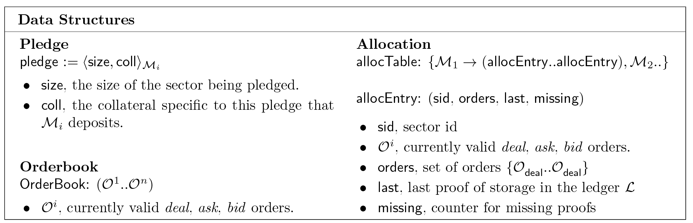
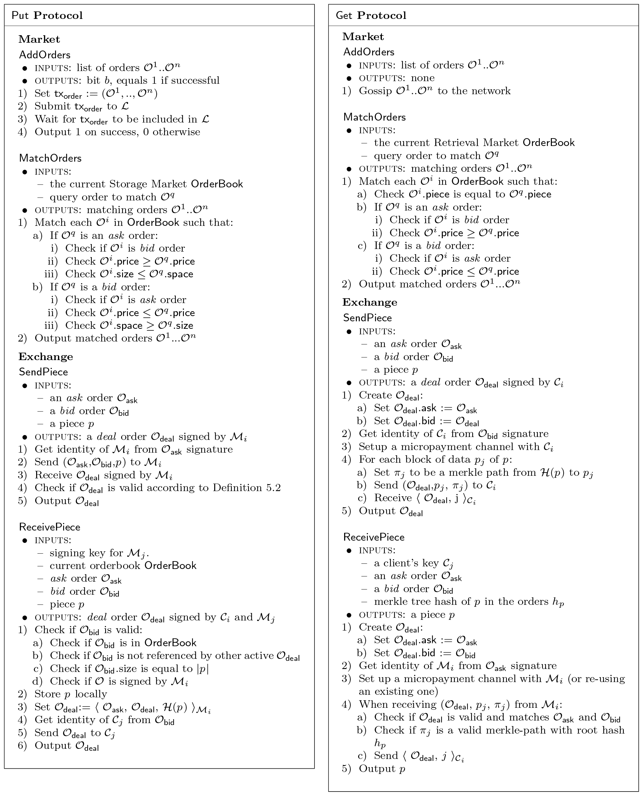
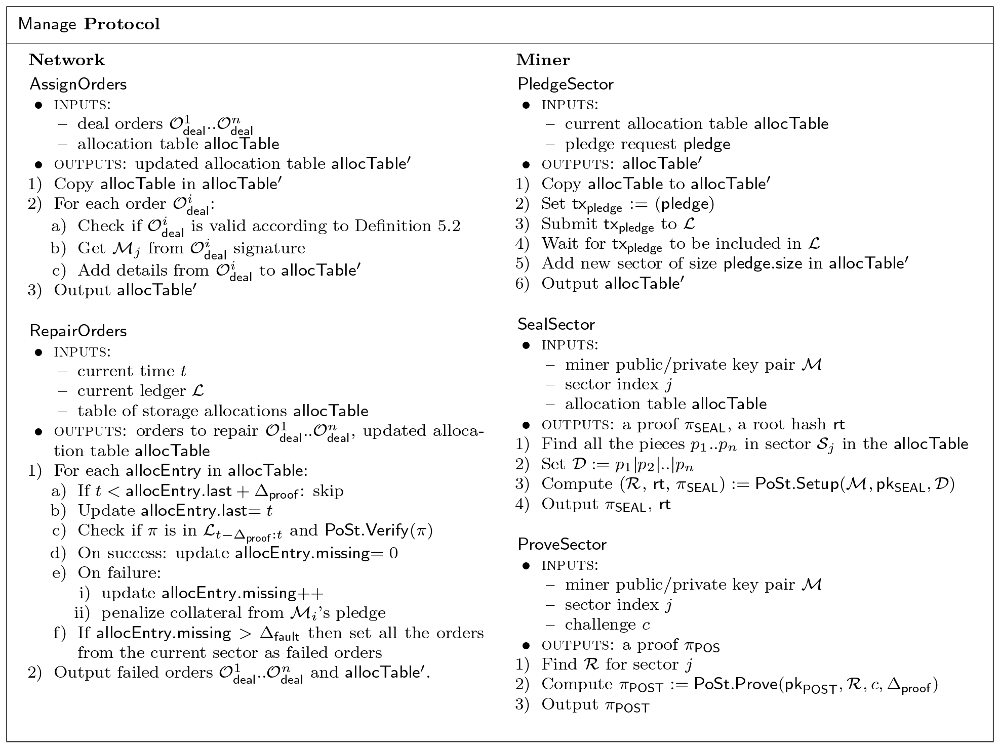
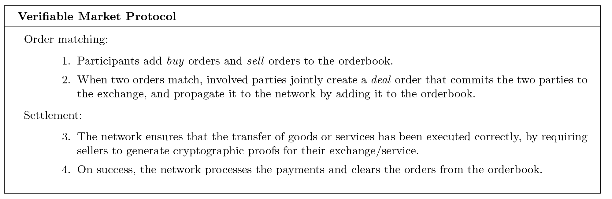
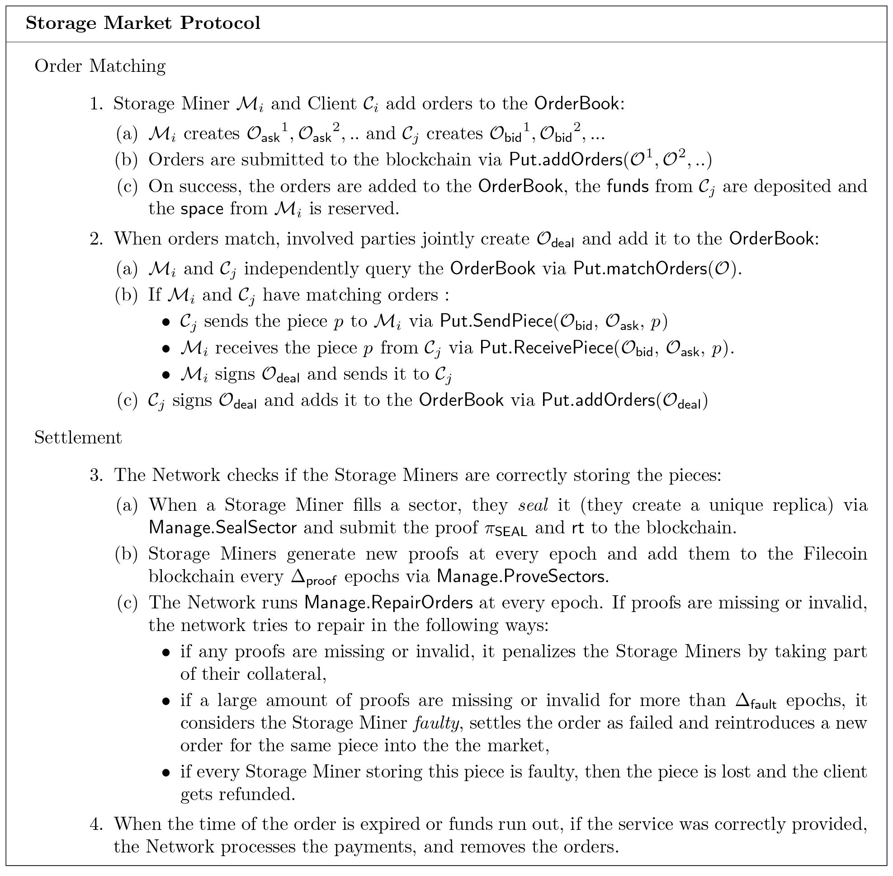
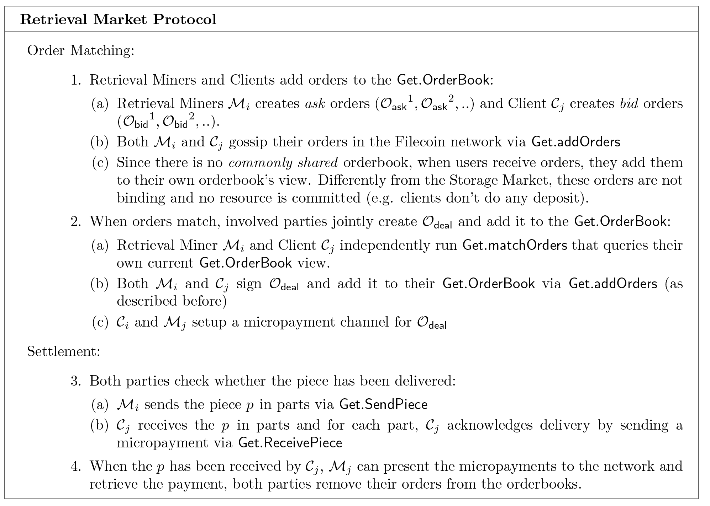

## 4 Filecoin:DSN构建

Filecoin DSN是可升级，可公开验证和激励式设计的去中心化的存储网络。客户为了存储数据和检索数据向矿工网络付费。矿工提供磁盘空间和带宽来赚取费用。矿工只有在网络可以审计他们的服务是否正确提供的时候才会收到付款。

在本节中，我们介绍基于DSN的定义和”时空证明“的Filecoin DSN构建。

### 4.1 环境

#### 4.1.1 参与者

任何用户都可以作为客户端、存储矿工和/或检索矿工来参与Filecoin网络。

* 客户在DSN中通过Put和Get请求存储数据或者检索数据，并为此付费。

* 存储矿工为网络提供数据存储。存储矿工通过提供他们的磁盘空间和响应Pug请求来参与Filecoin。要想成为存储矿工，用户必须用与存储空间成比例的抵押品来抵押。存储矿工通过在特定时间存储数据来响应用户的Put请求。存储矿工生成"时空证明”，并提交到区块链网络来证明他们在特定时间内存储了数据。假如证明无效或丢失，那存储矿工将被罚没他们的部分抵押品。存储矿工也有资格挖取新区块，如果挖到了新块，矿工就能得到挖取新块的奖励和包含在块中的交易费。

* 检索矿工为网络提供数据检索服务。检索矿工通过提供用户Get请求所需要的数据来参与Filecoin。和存储矿工不同，他们不需要抵押，不需要提交存储数据，不需要提供存储证明。存储矿工可以同时也作为检索矿工参与网络。检索矿工可以直接从客户或者从检索市场赚取收益。

#### 4.1.2 网络 N

我们将运行所有运行Filecoin全节点的所有用户细化为一个抽象实体：网络。该网络作为运行管理协议的中介。简单的说，Filecoin区块链的每个新块,全节点管理可用的存储，验证抵押品，审核存储证明已经修复可能的故障。

#### 4.1.3 账本

我们的协议适用于基于账本的货币。为了通用，我们称之为“账本” L。在任何给定的时间t(称为时期)，所有的用户都能访问Lt。当处于时期t的时候，账本是追加式的，它由顺序的一系列交易组成。Filecoin DSN协议可以在运行验证Filecoin的证明的任意账本上实现。在第六节中我们展示了我们如何基于有用的工作构建一个账本。

#### 4.1.4 市场

存储需求和供给组成了两个Filecoin市场：存储市场和检索市场。这两个市场是两个去中心化交易所，这会在第5节中详细解释。简而言之，客户和矿工们通过向各自的市场提交订单来设定他们请求服务或者提供服务的订单的价格。交易所为客户和矿工们提供了一种方式来查看匹配出价并执行订单。如果服务请求被成功满足，通过运行管理协议，网络保证了矿工得到报酬，客户将被收取费用。

### 4.2 数据结构

**碎片** 碎片是客户在DSN所存储数据的一部分。例如，数据是可以任意划分为许多片，并且每片都可以有不同集合的存储矿工来存储。

**扇区** 扇区是存款矿工向网络提供的一些磁盘空间。矿工将客户数据的碎片存储到扇区，并通过他们的服务来赚取令牌。为了存储碎片，矿工们必须向网络抵押他们的扇区。

**分配表** 分配表式衣柜数据结构，可以跟踪碎片和其分配的扇区。分配表在长辈的每个区块都会更新，Merkle根存储在最新的区块中。在实践中，该表用来保持DSN的状态，它使得在证明验证的过程中可以快速查找。更详细的信息，请参看图5。

**订单** 订单式请求或提供服务的意向声明。客户向市场提交投标订单来请求服务（存储数据的存储市场和检索数据的检索市场），矿工们提交报价订单来提供服务。订单数据结构如图10所示。市场协议将在第5节详细介绍。

**订单簿** 订单簿是订单的集合。请查看第5.2.2节的存储市场订单簿和第5.3.3节的检索市场订单簿。

**抵押** 抵押是像网络提供存储（特别是扇区）的承诺。存储矿工必须将抵押提交给账本，以便能在存储市场接受订单。抵押包括了抵押扇区的大小和存储矿工的存放的抵押品。

> 图5 DSN方案中的数据结构

### 4.3 协议

在本节中，我们通过描述客户端、矿工和网络执行的操作来概述Filecoin DSN。我们在图7中介绍了Get和Pug协议的方法，和在图8中的管理协议。一个协议执行的示例如图6所示。图1是Filecoin协议概览。

#### 4.3.1 客户生命周期

我们给出客户生命周期的概览：在第5节接下来的协议会做深度的解析。

1. Put：客户将数据存储于Filecoin
   客户可以通过向Filecoin中的矿工支付令牌来存储他们的数据。第5.2节详细介绍了Put协议。
   客户通过Put协议向存储市场的订单簿提交投标订单。当找到矿工的匹配报价订单的时候，客户会将数据发给矿工，并且双方签署交易订单将其提交到存储市场订单簿。客户可以通过提交的订单来决定数据的物理副本数量。更高的冗余度会有更高的存储故障容忍度。

2. Get：客户从Filecoin检索数据。客户可以通过使用Filecoin 令牌向存储矿工付费来检索任何数据。Get协议在第5.3节有详细描述。客户端通过执行Get协议向检索市场订单簿提交投标订单。当找到匹配的矿工报价订单后，客户会收到来自矿工的碎片。当收到的时候，双方对交易订单进行签名提交到区块链来确认交易成功。

4.3.2 挖矿周期（对于存储矿工）

我们给出一个非正式的挖矿周期概述。

1. **抵押**：存储矿工向网络抵押存储。

存储矿工通过在抵押交易中存放抵押品来保证向区块链提供存储。通过 Manage.PledgeSector ，抵押品被抵押一段期限是为了提供服务，如果矿工为他们所承诺提交存储的数据生成存储证明，抵押品就回返还给他们。如果存储证明失败了，一定数量的抵押品就会损失。他们设定价格并向市场订单簿提交报价订单，一旦抵押交易在区块链中出现，矿工就能在存储市场中提供他们的存储。

    Manage.PledgeSector 
    • inputs:
      – current allocation table allocTable
      – pledge request pledge
    • outputs: allocTable'

2. **接收订单**：存储矿工从存储市场获取存储请求。他们设定价格并通关过Put.AddOrders向市场订单簿提交报价订单，一旦抵押交易出现在区块链中，矿工就能在存储市场中提供他们的存储。

    Put.AddOrders
    • inputs: list of orders O1..On
    • outputs: bit b, equals 1 if successful

通过Put.MatchOrders 来检查是否和客户的报价订单匹配一致。

    Put.MatchOrders
    • inputs:
      – the current Storage Market OrderBook
      – query order to match Oq
    • outputs: matching orders O1..On

一定订单匹配，客户会讲他们的数据发给存储矿工。存储矿工接收到数据的时候，运行Put.ReceivePiece 。数据被接收完之后，矿工和客户签收订单并将其提交到区块链。

    Put.ReceivePiece
    • inputs: – signing key for Mj
      – current orderbook OrderBook
      – ask order Oask
      – bid order Obid
      – piece p
    • outputs: deal order Odeal signed by Ci and Mj

3. **密封**：存储矿工为未来的证明准备碎片。

    存储矿工的存储切分为扇区，每个扇区包括了分配给矿工的碎片。网络通过分配表来跟踪每个存储矿工的扇区。当存储矿工的扇区填满了，这个扇区就被密封起来。密封是一种缓慢的顺序操作。将扇区中的数据转换成为副本，然后将数据的唯一物理副本与存储矿工的公钥相关联。在“复制证明”期间密封式必须的操作。如下所述在第3.4节。

    Manage.SealSector
    • inputs:
      – miner public/private key pair M
      – sector index j
      – allocation table allocTable
    • outputs: a proof πSEAL, a root hash rt

4. **证明**：存储矿工证明他们正在存储所承诺的碎片（数据）。

当存储矿工分配数据时，必须重复生成复制证明以保证他们正在存储数据（有关更多详细信息，请参看第3节）证明发布在区块链中，并由网络来验证。

    Manage.ProveSector
    • inputs:
      – miner public/private key pair M
      – sector index j
      – challenge c
    • outputs: a proof πPOS

4.3.3 挖矿周期（对于检索矿工）

我们给出一个非正式的挖矿周期概述。

1. **收到订单**：检索矿工从检索市场得到获取数据的请求。

检索矿工设置价格并向市场订单簿增加报价订单，并通过向网络发送报价单来提供数据。

    Get.AddOrders
    • inputs: list of orders O1..On
    • outputs: none

然后检索矿工检查是否与客户的报价订单匹配一致。

    Get.MatchOrders
    • inputs:
      – the current Retrieval Market OrderBook
      – query order to match Oq
    • outputs: matching orders O1..On

2. **发送**：检索矿工向客户发送数据碎片。

    一旦订单匹配，检索矿工就将数据发送给客户（第5.3节有详细描述）。当数据被接收完成，矿工和客户就签署交易比ing提交到区块链。

    Put.SendPieces
    • inputs: – an ask order Oask
      – a bid order Obid
      – a piece p
    • outputs: a deal order Odeal signed by Mi

#### 4.3.4 网络周期

我们给出一个非正式的网络操作概述。

1. **分配**：网络将客户的碎片分配给存储矿工的扇区。

客户通过向存储市场提交报价订单来启动Put协议。当询价单和报价单匹配的时候，参与的各方共同承诺交易并向市场提交成交的订单。此时，网络将数据分配给矿工，并将其记录到分配表中。

    Manage.AssignOrders
    • inputs:
      – deal orders O1deal..Ondeal
      – allocation table allocTable
    • outputs: updated allocation table allocTable'

2.**修复**：网络发现故障并试图进行修复

所有的存储分配对于网络中的每个参与者都是公开的。对于每个块，网络会检查每个需要的证明都存在，检查它们是否有效，因此采取行动：

* 如果有任何证明的丢失或无效，网络会通过扣除部分抵押品的方式来惩罚存储矿工。

* 如果大量证明丢失或无效（由系统参数Δfault定义），网络会认定存储矿工存在故障，将订单设定为失败，并为同样的数据引入新订单进入市场。

* 如果所有存储该数据的存储矿工都有故障，则该数据丢失，客户获得退款。

    Manage.RepairOrders
    • inputs:
      – current time t
      – current ledger L
      – table of storage allocations allocTable
    • outputs: orders to repair O1deal..Ondeal, updated allocation table allocTable

> 图6 Filecoin DSN的示例执行，按方按组排序并按行按时间顺序排序

### 4.4 担保和要求

以下是Filecoin DSN如何实现完整性、可检索性，公开可验证性和激励兼容性。

* 实现完整性 数据碎片以加密哈希命名。一个Put请求后，客户只需要存储哈希即可通过Get操作来检索数据，并可以验证收到的数据的完整性。

* 实现可恢复性 在Put请求中，客户指定副本因子和代码期望擦除类型。假设给定的m个存储矿工存储数据，可以容忍最多f个故障，则该方式是(f, m)-tolerant存储。通过在不同的存储提供商存储数据，客户端可以增加恢复的机会，以防存储矿工下线或者消失。

* 实现公开可验证和可审核性 存储矿工需要提交其存储 (πSEAL, πPOST)的证明到区块链。网络中的任意用户都可以在不访问外包数据的情况下验证这些证明的有效性。另外由于这些证明都是存储在区块链上的，所以操作痕迹可以随时审核。

* 实现激励兼容性 不正式的说，矿工通过提供存储而获得奖励。当矿工承诺存储一些数据的时候，它们需要生成证明。如果矿工忽略了证明就回被惩罚（通过损失部分抵押品），并且不会收到存储的奖励。

* 实现保密性 如果客户希望他们的数据被隐私存储，那客户必须在数据提交到网络之前先进行加密。

> 图7 Filecoin DSN中Put和Get Protocols的描述

> 图8 Filecoin DSN中管理协议的描述

## 5 Filecoin的存储和检索市场

Filecoin有两个市场：存储市场和检索市场。这两个市场有同样的结构但不同的设计。存储市场允许客户为矿工存储数据而付费。检索数据允许客户为矿工提供检索数据传递而付费。在这两种情况下，客户和矿工可以设置报价和需求价格或者接受当前报价。这个交易是由网络来运行的-Filecoin中全节点是拟人化的。网络保证矿工在提供服务时可以得到客户的奖励。

### 5.1 验证市场

交易市场是促进特定商品和服务交换的协议。它们使得买家和买家促成交易。对于我们而言，我们要求交易是可验证的：去中心化网络的参与者必须能够在买家和卖家间验证交易。我们提出验证市场的概念。它没有单一的实体来管理交易，交易是透明的，任何人都可以匿名参与。可验证市场协议使得服务的交易去中心化：订单簿的一致性，订单结算和服务的正确执行是可以由参与者独立验证的-在Filecoin里面的矿工和全节点。我们简化可验证市场来进行以下构建：

**定义5.1.** 可验证市场是一个有两个阶段的协议：订单匹配和结算。订单是购买意图或者出售商品或服务安全性的表述，订单簿就是所有可用订单的列表。

> 图9 可验证市场的通用协议

### 5.2 存储市场

存储市场是可验证的市场，它允许客户（即买家）请求他们的存储数据和存储矿工（即卖家）提供他们的存储空间。

#### 5.2.1 需求

我们根据以下需求来设计存储市场协议：

* 链式订单簿 重要的是（1）存储空格的订单式公开的，所以最低价格的订单总是网络知名的，客户可以对订单做出明智的决定（2）客户订单必须始终提交给订单，即使他们接受接受最低的价格，这样市场就可以对新的报价做出反应。因此我们要求订单添加到Filecoin区块链，为的时能被加入订单簿。

* 参与者投入资源：我们要求参与双方承诺他们的资源作为避免损害的一种方式。为了避免存储矿工不提供服务和避免客户没有可用的资金。为了参与存储市场，存储矿工必须保证在DSN中存入与其存储量成比例的抵押品（更多详细信息请参看第4.3.3节）。通过这种方式，网络可以惩罚那些承诺存储数据但又不提供存储证明的存储矿工。同样的，客户必须向订单充入特定数量的资金，以这种方式保证在结算期间的资金可用性。

* 故障自处理 只有在存储矿工反复证明他们已经在约定的时间内存储了数据的情况下，订单才会结算给矿工。网络必须能够验证这些证明的存在性和正确性并且它们是按照规则来处理的。在4.3.4节有修复部分的概述。

#### 5.2.2 数据结构

Put订单 有三种类型的订单：出价订单，询价订单和交易订单。存储矿工创建询价订单添加存储，客户创建出价订单请求存储，当双方对价格达成一致时，他们共同创建处理订单。订单的数据结构和订单参数的明确定义如图10所示。

Put订单簿 存储市场的订单簿是目前有效和开放的询价，出价和 交易订单的集合。用户可以通过Put协议中定义的方法与订单簿进行交互：AddOrders,MatchOrders如图7所示。

订单簿是公开的，并且每个诚实的用户都有同样的订单簿试图。在每个周期，如果新的订单交易出现在新的区块中那它将被添加到订单簿中。如果订单被取消，取消或者结算，则会被删除。订单将被添加到区块链中，因此在订单簿中如果是有效的：

**定义5.2.** 我们定义出价，询价，交易订单的有效性：

（有效出价单） 从客户端发出的投标单Ci,Obid:= (hsize, funds[, price,time, coll, coding])>Ci,如果满足下面的条件就是有效的：

* Ci 在他们的账户里面至少有可用的资金
* 时间没有超时
* 订单必须保证最少的存储周期（这是个系统参数）

（有效询价单） 从存储矿工发出的询价单Mi，Oask:= (hspace, pricei)Mi，如果满足下面的条件就是有效的：

* Mi承诺为矿工，并且质押期不会在订单周期之前到期
* 空间必须小于Mi的可用存储。Mi在订单中减去承诺的存储（在询价订单和交易订单中）

（有效交易订单） 交易订单Odeal:= (hask, bid,ts)Ci,Mj，如果满足下面的条件就是有效的：

* 询问参考订单Oask，使得：它由Ci签署，且在存储市场的订单簿中没有其他订单涉及它。
* 出价订单参考订单Obid，使得：它由Mj签署，且在存储市场的订单簿中没有其他订单涉及它。
* ts 不能设置为将来时间或者太早的时间

如果作恶客户端从存储矿工出收到了签名的交易，但从来没有将其添加到订单簿，那么存储矿工就无法重新使用订单中提交的存储。这个字段ts就可以防止这种攻击，因为，在超过ts之后，订单变得无效，将无法在订单簿中提交。

> 图10 订购检索和存储市场的数据结构

#### 5.2.3 存储市场协议

简而言之，存储市场协议分为两个阶段：订单匹配和结算：

* 订单匹配：客户端和存储矿工通过提交交易到区块链来将订单提交到订单簿（步骤1）。当订单匹配时，客户端发送数据碎片给存储矿工，双方签署交易并提交到订单簿（步骤2）。

* 结算： 存储矿工密封扇区（步骤3a），生成扇区所包含的碎片的存储证明，并将其定期提交到区块链（步骤3b)；同时，其余的网络必须验证矿工生成的证明并修复可能的故障（步骤3c）。

存储市场协议在图11中详细描述。

### 5.3 检索市场

检索市场允许客户端请求检索特定的数据，由检索矿工提供这个服务。与存储矿工不同，检索矿工不要求在特定时间周期内存储数据或者生成存储证明。在网络中的任何用户都可以成为检索矿工，通过提供提供检索服务来赚取Filecoin令牌。检索矿工可以直接从客户端或者检索接收数据碎片，也可以存储它们成为存储矿工。

#### 5.3.1 需求

我们根据以下的需求来设计检索市场协议：

* 链下订单簿 客户端必须能够找到提供所需要数据碎片的检索矿工，并且在定价之后直接交换。这意味着订单簿不能通过区块链来运行-因为这将成为快速检索请求的瓶颈。相反的，参与者只能看到订单簿的部分视图。我们要求双方传播自己的订单。

* 无信任方检索 公平交换的不可能性[10]提醒我们双方不可能没有信任方的进行交流。在存储市场中，区块链网络作为去中心化信任方来验证存储矿工提供的存储。在检索市场，检索矿工和客户端在没有网络见证所交换文件的情况下来交换数据。我们通过要求检查矿工将数据分割成多个部分并将每个部分发送给客户端来达到这个目的，矿工们将收到付款。在这种方式中，如果客户端停止付款，或者矿工停止发送数据，任何一方都可以终止这个交易。注意的是，我们必须总是假设总是有一个诚实的检索矿工。

* 支付通道 客户端当提交付款的时候可以立即进行检索感兴趣的碎片。检索矿工只有在确认收到付款的时候才会提供数据碎片。通过公共账本来确认交易可能会成为检索请求的瓶颈，所以，我们必须依靠有效的链下支付。Filecoin区块链必须支持快速的支付通道，只有乐观交易和仅在出现纠纷的情况下才使用区块链。通过这种方式，检索矿工和客户端可以快速发送Filecoin协议所要求的小额支付。未来的工作里包含了创建一个如[11,12]所述的支付通道网络。

#### 5.3.2 数据结构

获取订单 检索市场中包含有三种类型的订单：客户端创建的出价单 Obid，检索矿工创建的询价单Oask，和存储矿工和客户端达成的交易订单Odeal。订单的数据结构如图10所示。

获取订单簿 检索市场的订单簿是有效的和公开出价订单，询价订单和交易订单的集合。与存储市场不同，每个用户有不同的订单簿试图，因为订单式在网络中传播的，每个矿工和客户端只会跟踪他们所感兴趣的订单。

> 图11 详细的存储市场协议

#### 5.3.3 检索市场协议

简而言之，检索市场协议分为两个阶段：订单匹配和结算：

* 订单匹配 客户端和检索矿工通过广播将订单提交给订单簿（步骤1）。当订单匹配的时候，客户端和检索矿工简历小额支付通道（步骤2）。

* 结算 检索矿工发送小部分的碎片给到客户端，然后对每个碎片客户端会向矿工发送收妥的收据（步骤3）。检索矿工向区块链出示收据从而获得奖励（步骤4）。

该协议在图12中详细解释。

> 图12 详细检索市场协议

------

右侧导航栏快速筛选章节

[下部分：IPFS白皮书 中文版 III](/tutorial/whitepaperc.html)  [上部分：IPFS白皮书 中文版 I](/tutorial/whitepapera.html)