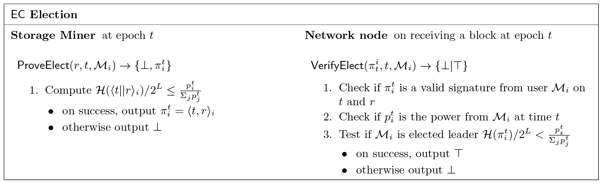

## 6 有用工作共识

Filecoin DSN协议可以在允许验证的任何共识协议之上实现Filecoin的证明。在本节中，我们将结算如何基于有用来引导共识协议。Filecoin矿工生成“时空证明”来参与共识，而不是浪费的POW。

有用 如果计算的输出对网络来说是有价值的，而不仅仅是为了保证区块链的安全。我们认为矿工在共识协议中所作的工作是有用的。

### 6.1 动机

确保区块链的安全是至关重要的。POW的证明方案往往要求不能重复使用的或者需要大量的浪费计算才能找到难题的解决方案。

* **不可重复利用的工作** 大多数无许可型的区块链要求矿工解决硬计算难题，譬如反转哈希函数。通常情况下这些解决方案都是无用的，除了保护网络安全之外，没有其他任何价值。我们可以重新设计让这件事有用吗？
尝试重复使用的工作：已经有几个尝试重复使用挖矿电路进行有用的计算。有些尝试是要求矿工与标准的POW同时进行一些特殊计算，其他一些尝试用有用问题替代POW的依然难以解决。例如，Primecoin重新使用矿工的计算能力来找到新的素数，以太坊要求矿工与工作证明一起执行小程序，同时证明某些数据正在归档。虽然这些尝试中的大多数都执行有用的工作，但在这些计算中浪费的工作量仍然很普遍的。

* **浪费的工作** 解决难题在机器成本和能力消耗方面是非常昂贵的，特别是如果这些难题完全依赖计算能力。当挖矿算法不能并发的时候，那解决难题的普通因素就是计算的功率。我们可以减少浪费的工作吗？
试图减少浪费：理想情况下，大部分网络资源应该花费在有用的工作上。一些尝试是要求矿工使用更节能的解决方案。例如，“空间挖矿”（？Spacemint）要求矿工致力于磁盘空间而不是计算；虽然更加节能，但磁盘空间依然”浪费“，因为它们被随时的数据填满了。其他的尝试是用基于权益证明的传统拜占庭协议来代替难题的解决，其中利益相关方在下一个块的投票与其在系统中所占有的货币份额成正比。

我们着手设计一个基于用户数据存储的有用工作的共识协议。

### 6.2 Filecoin 共识

我们提出了一个有用的工作共识协议，其中网络选择矿工创建新区块的概率（我们称之为矿工的投票权）与其当前使用的存储成比例，与其余的相关。 网络。 我们设计了Filecoin协议，以便矿工宁愿投资存储而不是计算能力来并行化挖掘计算。 矿工提供存储并重新使用计算以证明数据被存储以参与共识。

#### 6.2.1 采矿电力建模
功率容错 在我们的技术报告[13]中，我们提出了功率容错，这是对在参与者对协议结果的影响方面重新构建拜占庭故障的抽象。每个参与者控制了网络总功率n中的一部分功率，其中f是故障节点或作恶节点所控制的功率占比。

Filecoin功率在Filecoin中，在时刻t，矿工Mi的功率Pt>i是Mi总和的存储任务。Mi的 Iti是网络中Mi总功率的影响因子。

在Filecoin中，功率有以下属性：

* 公开：网络中当前正在使用的存储总量是公开的。通过读取区块链，任何人都可以计算每个矿工的存储任务-因此任何人都可以计算出在任意时间点的每个矿工的功率和总功率。

* 可公开验证的：对于每个存储任务，矿工都需要生成”时空证明“，证明持续提供服务。通过读取区块链，任何人都可以验证矿工的功率声明是否是正确的。

* 变量： 在任意时间点，矿工都可以通过增加新增扇区和扇区补充的抵押来增加新的存储。这样矿工就能变更他们能提供的功率。

#### 6.2.2 功率会计与时空证明

每个∆proof 区块（∆proof 是系统参数），矿工们都必须向网络提交“时空证明”，只有网络中大多数功率认为它们是有效的，才会被城管添加到区块链。在每个区块中，每个圈节点会更新分配表（AllocTable），添加新的存储分配、删除过期的和标记缺少证明的记录。可以通过对分配表的记录来对矿工Mi的功率进行计算和验证。这些可以通过两种方式来完成：

* **全节点验证**：如果节点拥有完整的区块链记录，则可以从创始块开始运行网络协议直到当前区块，这个过程中验证每一个分配给Mi的“时空证明”。

* **简单存储验证**：假设轻客户端可以访问广播最新区块的信任源。请客户端可以从网络中的节点请求（1）Mi在当前分配表中的记录 （2）该记录被包含在最新区块的状态树中的Merkle路径（3）从创世块到当前区块的区块头。这样请客户端就可以将“时空证明”的验证委托给网络。

功率计算的安全性来自于“时空证明”的安全性。在这个设置里面，Post保证了矿工无法对他们所分配的存储数量说谎。事实上，他们不能声称能够存储超过他们的存储空间的数据，因为这会花费时间来运行PoSt.Setup，另外PoSt.Prove是串行的计算，并不能并行化的快速生成证明。

#### 6.2.3 使用功率达成共识

我们预计通过扩展现在（和未来）的权益证明共识协议来实现Filecoin共识的多种策略，其中权益被替换为分配的存储。我们预计了权益证明协议的改进，我们提出了一个基于我们前期工作，称为预期共识的构建[14]。我们的策略是在每一轮选举一个（或多个）矿工，使得赢得选举的概率与每个矿工分配的存储成比例。

预期共识 预期共识的基本直觉是确定性的，不可预测的。并在每个周期内秘密选举一个小的Leader集合。预期的期望是每个周期内当选的Leader是1，但一些周期内可能有0个或者许多的Leader。Leader们通过创建新区块并广播来扩展区块链网络。在每个周期，每个区块链被延伸一个或多个区块。在某个无Leader的周期内，控区块被添加到区块链中。虽然链中的区块可以线性排序，其数据结构是有向无环图。EC是一个概率共识，每个周期都使得比前面的区块更加确定，最终达到了足够的确定性，且出现不同的历史块链的可能性是足够小的。如果大多数的参与者都通过签署区块链来扩展区块链，加大这个区块所属链的权重，那么这个区块就被确认了。

选举矿工 在每个周期，每个矿工检查他们是否被选为Leader，这类似于完成前面的协议:CoA[15],白皮书[16]，和算法[17]。

译者注：下面的公式表达式请参考英文原版为佳

**定义6.1.** 如果下面的条件是满足的，则在时刻t 矿工Mi 是Leader：


其中rand(t)是在时刻t，可以从区块链中提取出来的公开的随机变量，Pt>i是Mi的功率。考虑对于任意的m，L是H(m)的大小，H是一种安全的加密散列函数，其中（m)Mi是Mi对消息m的签名，使得：


在图13中，我们描述了矿工（ProveElect）和网络节点（VerifyElect）之间的协议。这种选举方案提供了三个属性：公平，保密和公开的可验证性。

* 公平 每个参与者每次选举只有一次试验，因为签名是确定性的，而且t和rand(t)是固定的。假设H是安全的加密散列函数，则H(
  Mi)/2L必须是从（0，1）均匀选择的实数，因此，可能使得方程等式为true必须是Pti/Σjptj，这等于矿工在在网络中的部分功率。因为这个概率在功率上市线性的，这种可能性在分裂或者汇集功率情况下被保留。注意随机值rand(t)在时刻t之前是未知的。

* 保密 由于有能力的攻击者不拥有Mi用来计算签名的秘钥，考虑到数字签名的假设，这个是可以忽略不计的。

* 公开可验证： 当选Leader i ∈ Lt 可以通过给出t，rand(t)，H(i)/2L，来说服一个有效的验证者。鉴于前面的观点，有能力的攻击者在不拥有获胜秘密秘钥的情况下不能生成证明。



> 图13 预期共识议定书中的领导人选举

## 7 智能合约

Filecoin为最终用户提供了两个基本原语：Get和Put。 这些原语允许客户以他们的首选价格存储数据并从市场中检索数据。 虽然原语涵盖了Filecoin的默认用例，但我们通过支持智能合约的部署，允许在Get和Put之上设计更复杂的操作。 用户可以编写新的细粒度存储/检索请求，我们将其归类为文件合同以及通用智能合约。 我们整合了一个Contracts系统（基于[18]）和一个Bridge系统，将Filecoin存储在其他区块链中，反之亦然，以便在Filecoin中引入其他区块链的功能。

我们期望在Filecoin生态系统中存在大量智能合约，我们期待着一个智能合约开发者社区。

### 7.1 Filecoin智能合约

智能合约使得Filecoin的用户可以编写有状态的程序，来花费令牌向市场请求存储J/检索数据和验证存储证明。用户可以通过将交易发送到账本触发合约中的功能函数来与智能合约交互。我们扩展了智能合约系统来支持Filecoin的特定操作（如市场操作，证明验证）。

* 文件合约： 我们允许用户对他们提供的存储服务进行条件编程。有几个例子值得一提：（1）承包矿工：客户可以提前指定矿工提供服务而不参与市场 （2）付款策略：客户可以为矿工设计不同的奖励策略，例如合约可以给矿工支付随着时间的推移越来高的费用 ，另一个合约可以由值得信任的Oracle的通知来设置存储的价格。（3）票务服务：合约可以允许矿工存放令牌和用于代表用户的存储/检索的支付 （4）更复杂的操作：客户可以创建合约来运行数据更新。

* 智能合约：用户可以将程序关联到其他系统（如以太坊[18]）他们的交易上,他们不直接依赖存储的使用。我们预见了以下的应用程序：去中心化命名服务，资产跟踪和预售平台。

### 7.2 与其他系统的集成

桥是旨在连接不同区块链的工具；现在正在处理中的，我们计划支持跨链交互，以便能将Filecoin存储带入其他基于区块链的平台，同时也将其他平台的功能带入Filecoin。

* Filecoin进入其他平台：其他的区块链系统，如比特币[19]，Zcash [20]，特别是Ethereum [18]和Tezos，允许开发人员写智能合约；然而，这些平台只提供很少的存储能力和非常高的成本。我们计划提供桥将存储和检索支持带入这些平台。我们注意到，IPFS已经被作为几个智能合约（和协议令牌）引用和分发内容的一种方式来使用。增加到Filecoin的支持将允许这些系统以交换Filecoin令牌的方式来保证IPFS存储内容。

* 其他平台进入Filecoin：我们计划提供Filecoin连接其他区块链服务的桥。例如，与Zcash的集成将支持发送隐私数据的存储请求。

## 8 未来的工作

这项工作为Filecoin网络的建设提供了一个清晰和凝聚的道路;但是，我们也认为这项工作将成为今后研究去中心化存储系统的起点。在这个我们识别和填充三类未来 工作。这包括已经完成只是等待描述和发布的工作，提出改进当前协议的开放式问题，和协议的形式化。

### 8.1 正在进行的工作

以下主题代表正在进行的工作。

* 每个块中的Filecoin状态树的规范。
* Filecoin及其组件的详细绩效估计和基准。
* 完全可实现的Filecoin协议规范。
* 赞助检索票务模型，其中通过分配每个可持票花费的令牌，任何客户端C1可以赞助另一个客户端C2的下载。
* 分层共识协议，其中Filecoin子网可以在临时或永久分区进行分区并继续处理事务。
* 使用SNARK / STARK增量区块链快照。
* FileCoin-Ethereum合约接口和协议。
* 使用编织（Braid？）进行区块链归档和区块链间冲压。
* 只有在区块链解决冲突的时候才发布"时空证明”。
* 正式证明实现了Filecoin DSN和新型存储证明。

### 8.2 开放式问题

作为一个整体，有一些公开的问题，其答案有可能可以大大改善网络。尽管事实上，在正式启动之前并不是必须必须解决的问题。

* 一个更好的原始的"复制证明“密封功能，理想情况下是O（n）解码（不是O（nm）），可公开验证，无需SNARK / STARK。
* “复制证明”功能的一个更好的原语，可以公开验证和透明没有SNARK / STARK。
* 一个透明，可公开验证的可检索证明或其他存储证明。
* 在检索市场中进行检索的新策略（例如，基于概率支付，零知识条件支付）。
* “预期共识”更好的秘密Leader选举，在每个周期，只有一位当选Leader。
* 更好的可信赖的SNARK设置方案，允许增加扩展公共参数（可以运行MPC序列的方案，其中每个附加的MPC严格降低故障概率，并且每个MPC的输出可用于系统）。

### 8.3 证明和正式的验证

由于证明和正式验证的明确价值，我们计划证明Filecoin网络的许多属性，并在未来几个月和几年内开发正式验证的协议规范。几个证明正在进行中还有些正在思考中。但注意，要证明Filecoin的许多属性（如伸缩，离线）将是艰难的，长期的工作。

* 预期共识和变体的正确性证明。
* 功率故障容错正确性的证明，异步1/2不可能导致分叉。
* 在通用组合框架中制定Filecoin DSN，描述Get，Put和Manage作为理想的功能，并证明我们的实现。
* 自动自愈保证的正式模型和证明。
* 正式验证协议描述（例如TLA +或Verdi）。
* 正式验证实现（例如Verdi）。
* Filecoin激励的游戏理论分析。

致谢

这项工作是Protocol Labs团队中多个人的累积努力，如果没有实验室的合作者和顾问的帮助、评论和审查这是不可能完成的。 Juan Benet在2014年写了原始的Filecoin白皮书，为这项工作奠定了基础。他和尼古拉·格雷科（Nicola Greco）开发了新的协议，并与提供了有用的贡献，评论，审查意见的团队其他人合作编写了这份白皮书。特别是大卫“大卫”Dalrymple提出了订单范例和其他想法，Matt Zumwalt改进了在这篇论文中的结构，伊万·米亚佐诺（Evan Miyazono）创建了插图，并完成了这篇论文，在设计协议时，Jeromy Johnson提出了深刻的见解，Steven Allen提供了深刻的问题和清晰的说明。我们也感谢所有的合作者和顾问进行有用的对话;尤其是Andrew Miller和Eli Ben-Sasson。

以前版本：QmVcyYg2qLBS2fNhdeaNN1HvdEpLwpitesbsQwneYXwrKV

## 参考文献 

```
[1] Juan Benet. IPFS - Content Addressed, Versioned, P2P File System. 2014.

[2] Giuseppe Ateniese, Randal Burns, Reza Curtmola, Joseph Herring, Lea Kissner, Zachary Peterson, and Dawn Song. Provable data possession at untrusted stores. In Proceedings of the 14th ACM conference on Computer and communications security, pages 598–609. Acm, 2007. 

[3] Ari Juels and Burton S Kaliski Jr. Pors: Proofs of retrievability for large files. In Proceedings of the 14th ACM conference on Computer and communications security, pages 584–597. Acm, 2007. 

[4] Hovav Shacham and Brent Waters. Compact proofs of retrievability. In International Conference on the Theory and Application of Cryptology and Information Security, pages 90–107. Springer, 2008. 

[5] Protocol Labs. Technical Report: Proof-of-Replication. 2017.

[6] Rosario Gennaro, Craig Gentry, Bryan Parno, and Mariana Raykova. Quadratic span programs and succinct nizks without pcps. In Annual International Conference on the Theory and Applications of Cryptographic Techniques, pages 626–645. Springer, 2013. 

[7] Nir Bitansky, Alessandro Chiesa, and Yuval Ishai. Succinct non-interactive arguments via linear interactive proofs. Springer, 2013.

[8] Eli Ben-Sasson, Alessandro Chiesa, Daniel Genkin, Eran Tromer, and Madars Virza. Snarks for c: Verifying program executions succinctly and in zero knowledge. In Advances in Cryptology–CRYPTO 2013, pages 90–108. Springer, 2013. 

[9] Eli Ben-Sasson, Iddo Bentov, Alessandro Chiesa, Ariel Gabizon, Daniel Genkin, Matan Hamilis, Evgenya Pergament, Michael Riabzev, Mark Silberstein, Eran Tromer, et al. Computational integrity with a public random string from quasi-linear pcps. In Annual International Conference on the Theory and Applications of Cryptographic Techniques, pages 551–579. Springer, 2017. 

[10] Henning Pagnia and Felix C G¨artner. On the impossibility of fair exchange without a trusted third party. Technical report, Technical Report TUD-BS-1999-02, Darmstadt University of Technology, Department of Computer Science, Darmstadt, Germany, 1999. 

[11] Joseph Poon and Thaddeus Dryja. The bitcoin lightning network: Scalable off-chain instant payments. 2015. 

[12] Andrew Miller, Iddo Bentov, Ranjit Kumaresan, and Patrick McCorry. Sprites: Payment channels that go faster than lightning. arXiv preprint arXiv:1702.05812, 2017. 

[13] Protocol Labs. Technical Report: Power Fault Tolerance. 2017. 

[14] Protocol Labs. Technical Report: Expected Consensus. 2017. 

[15] Iddo Bentov, Charles Lee, Alex Mizrahi, and Meni Rosenfeld. Proof of activity: Extending bitcoin’s proof of work via proof of stake [extended abstract] y. ACM SIGMETRICS Performance Evaluation Review, 42(3):34–37, 2014. 

[16] Iddo Bentov, Rafael Pass, and Elaine Shi. Snow white: Provably secure proofs of stake. 2016. 

[17] Silvio Micali. Algorand: The efficient and democratic ledger. arXiv preprint arXiv:1607.01341, 2016. 

[18] Vitalik Buterin. Ethereum , April 2014. URL https://ethereum.org/. 

[19] Satoshi Nakamoto. Bitcoin: A peer-to-peer electronic cash system, 2008. 

[20] Eli Ben Sasson, Alessandro Chiesa, Christina Garman, Matthew Green, Ian Miers, Eran Tromer, and Madars Virza. Zerocash: Decentralized anonymous payments from bitcoin. In Security and Privacy (SP), 2014 IEEE Symposium on, pages 459–474. IEEE, 2014.

```

------

编辑整理：站长 [cho](https://www.binstd.com/u/cho) 打赏

1. BTC: `1Af2Q23Y1kqgtgbryzjS7RxrnEmyvYuX4b`
2. ETH: `0x6bcCfb7265d4aB0C1a71F7d19b9E581cae73D777`

------

右侧导航栏快速筛选章节

[上部分：IPFS白皮书 中文版 II](/tutorial/whitepaperb.html)